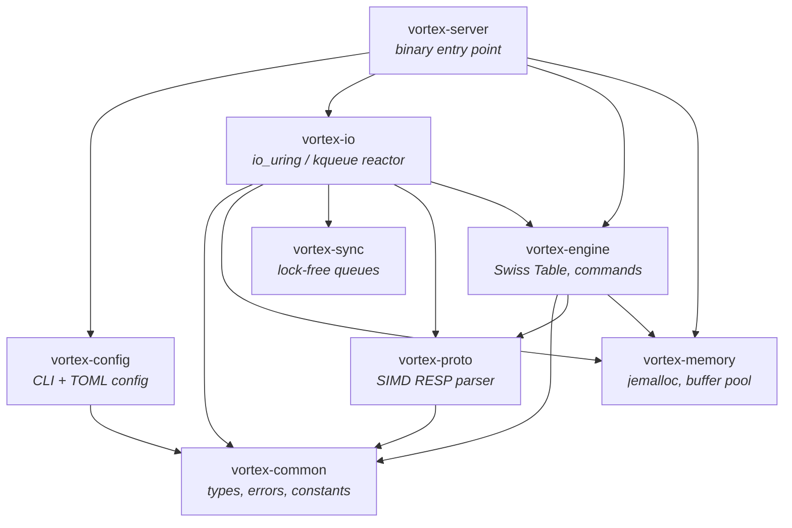

# VortexDB

[](https://github.com/kevincaicedo/vortex/actions/workflows/ci.yml)
[](LICENSE)

> Next-generation, Redis-compatible in-memory database written in Rust. Built for raw throughput with io_uring, SIMD parsing, and a cache-line-optimized Swiss Table engine.

VortexDB is a high-performance, drop-in Redis replacement built from the ground up in Rust. It uses a thread-per-core architecture, io_uring (Linux) / kqueue (macOS), SIMD-accelerated RESP parsing, and a cache-line-optimized Swiss Table hash map. On Linux with io_uring it delivers 1.0–3.7× throughput improvements over Redis depending on command type, with the largest gains on multi-key batch operations (MSET, MSETNX).

## Benchmark Results

All benchmarks use `redis-benchmark` (100K requests, 50 clients, pipeline 16). Redis 8.6.2 configured with `io-threads 4`.

### Linux (Docker-All, i7-13700KF, identical containers, 4 CPUs / 2 GB each)

| Command | VortexDB | Redis 8 | vs Redis |
|---------|----------|---------|----------|
| SET | 3,448,276 | 2,325,581 | **1.5×** |
| GET | 3,571,429 | 3,225,806 | **1.1×** |
| INCR | 3,448,276 | 3,030,303 | **1.1×** |
| MSET (10) | 2,941,176 | 892,857 | **3.3×** |
| MSETNX (10) | 3,448,276 | 980,392 | **3.5×** |
| INCRBYFLOAT | 3,333,333 | 1,369,863 | **2.4×** |
| PING_INLINE | 1,612,903 | 3,225,806 | **0.5×** |

### macOS (Native, Apple M4 Pro, both VortexDB and Redis native, kqueue)

| Command | VortexDB | Redis 8 | vs Redis |
|---------|----------|---------|----------|
| SET | 1,923,076 | 1,960,784 | **1.0×** |
| GET | 2,272,727 | 1,923,076 | **1.2×** |
| INCR | 2,325,581 | 1,960,784 | **1.2×** |
| MSET (10) | 1,470,588 | 598,802 | **2.5×** |
| MSETNX (10) | 2,000,000 | 917,431 | **2.2×** |
| INCRBYFLOAT | 2,325,581 | 1,612,903 | **1.4×** |
| PING_INLINE | 1,923,076 | 2,000,000 | **1.0×** |

> **Key insight:** VortexDB's engine excels at multi-key batch operations (MSET 2–3.5×) where the SwissTable's batch-prefetch pipeline and zero-copy serializer shine. Single-key reads (GET, PING) are at parity on macOS/kqueue and 1.0–1.5× on Linux/io_uring. PING_INLINE is I/O-bound and does not reflect engine performance.

Full results with 50+ commands, latency percentiles, Docker-all / native modes, and methodology: [docs/benchmarks.md](docs/benchmarks.md)

## Why VortexDB is Fast

| Technique | Impact |
|-----------|--------|
| **Thread-per-core** — no mutexes on hot path | Eliminates lock contention |
| **io_uring** — zero-syscall I/O on Linux | Removes read/write system call overhead |
| **SIMD Swiss Table** — single instruction probes 16 slots | GET in ~5 ns |
| **64-byte cache-line entries** — key + value + TTL inline | 2 cache lines per lookup, zero pointer chasing |
| **SIMD RESP parser** — AVX2/NEON CRLF scanning | >2 GB/s parse throughput per core |
| **SWAR command dispatch** — branchless uppercase + PHF lookup | ~8.7 ns per command dispatch |
| **jemalloc** — thread-local caching, zero malloc contention | Predictable allocation latency |

## Quick Start

### Build & Run

```sh
# Clone and build
git clone https://github.com/vortexdb/vortex.git
cd vortex
cargo build --release --bin vortex-server

# Start the server (default: 127.0.0.1:6379)
./target/release/vortex-server

# Connect with any Redis client
redis-cli -p 6379
> SET hello world
OK
> GET hello
"world"
```

### Docker

```sh
# Build production image (~52 MB)
docker build -t vortexdb:latest .

# Run
docker run -p 6379:6379 vortexdb:latest
```

### Using Just (Recommended)

```sh
cargo install just

just build          # Build workspace
just test           # Run all 485 tests
just clippy         # Lint check
just bench          # Run 69 Criterion benchmarks
just miri           # Memory safety checks (~42s)
just compare        # Competitive benchmark vs Redis/Dragonfly/Valkey
just compare-docker # containerized Competitive benchmark
```

## Supported Commands (55)

VortexDB v0.1-alpha implements all Redis String and Key commands — everything needed for key-value caches, session stores, and counters.

**String (20):** GET, SET, SETNX, SETEX, PSETEX, MGET, MSET, MSETNX, GETSET, GETDEL, GETEX, GETRANGE, SETRANGE, INCR, DECR, INCRBY, DECRBY, INCRBYFLOAT, APPEND, STRLEN

**Key (20):** DEL, UNLINK, EXISTS, EXPIRE, PEXPIRE, EXPIREAT, PEXPIREAT, PERSIST, TTL, PTTL, EXPIRETIME, PEXPIRETIME, TYPE, RENAME, RENAMENX, KEYS, SCAN, RANDOMKEY, TOUCH, COPY

**Server (15):** PING, ECHO, QUIT, DBSIZE, FLUSHDB, FLUSHALL, INFO, COMMAND, SELECT, TIME, MULTI, EXEC, DISCARD, WATCH, UNWATCH

Full compatibility matrix: [docs/compatibility.md](docs/compatibility.md)

## Architecture

VortexDB is a 17-crate Rust workspace with strict layered dependencies.



**Request path:** Client → io_uring/kqueue CQE → SIMD RESP parse → SWAR command dispatch → Swiss Table SIMD probe → pre-computed RESP response → io_uring/writev write

Full architecture guide: [docs/architecture.md](docs/architecture.md)

## Documentation

| Document | Description |
|----------|-------------|
| [Architecture Guide](docs/architecture.md) | Crate map, data flow, threading model, memory layout |
| [Command Compatibility](docs/compatibility.md) | Every Redis command: implemented, planned, or won't-implement |
| [Benchmark Methodology](docs/benchmarks.md) | Hardware specs, tools, how to reproduce, full results |
| [Migration Guide](docs/migration.md) | Step-by-step Redis → VortexDB migration |
| [Configuration Reference](docs/configuration.md) | All CLI flags, env vars, TOML options with defaults |
| [Contributing](CONTRIBUTING.md) | Development workflow, testing, CI, code standards |

## Prerequisites

- **Rust nightly** — pinned via `rust-toolchain.toml` (nightly-2026-03-15)
- **Linux** recommended for `io_uring` support; macOS uses `kqueue` fallback
- **redis-cli** / **redis-benchmark** — for client testing and benchmarks

```sh
# Install Rust (nightly auto-selected on first build)
curl --proto '=https' --tlsv1.2 -sSf https://sh.rustup.rs | sh

# Linux: io_uring headers (optional)
sudo apt-get install -y liburing-dev

# macOS: no additional deps needed
```

## Project Structure

```
vortex/
├── crates/
│   ├── vortex-common/       # Foundation types (VortexKey, VortexValue, errors)
│   ├── vortex-memory/       # jemalloc, mmap buffer pool, arena allocator
│   ├── vortex-sync/         # Lock-free SPSC/MPSC, sharded counters
│   ├── vortex-proto/        # SIMD RESP2/RESP3 parser & serializer
│   ├── vortex-engine/       # Swiss Table, shard, 55 command handlers
│   ├── vortex-io/           # Thread-per-core reactor (io_uring/kqueue)
│   ├── vortex-config/       # CLI + TOML + env configuration
│   ├── vortex-persist/      # AOF, VXF snapshots (planned)
│   ├── vortex-cluster/      # Cluster protocol, gossip (planned)
│   ├── vortex-replication/  # Leader-follower replication (planned)
│   ├── vortex-pubsub/       # Pub/Sub (planned)
│   ├── vortex-scripting/    # Lua scripting (planned)
│   ├── vortex-acl/          # Access control (planned)
│   ├── vortex-metrics/      # Prometheus metrics (planned)
│   └── vortex-server/       # Server binary entry point
├── tools/
│   ├── vortex-cli/          # Interactive CLI client
│   └── vortex-bench/        # 69 Criterion benchmarks
├── fuzz/                    # cargo-fuzz targets & corpus
├── scripts/                 # Benchmark & flamegraph scripts
├── docs/                    # Architecture, compatibility, benchmarks, migration
└── .github/workflows/       # CI (test, clippy, miri, asan, tsan, bench)
```

## License

Apache-2.0
