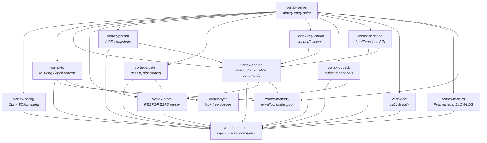
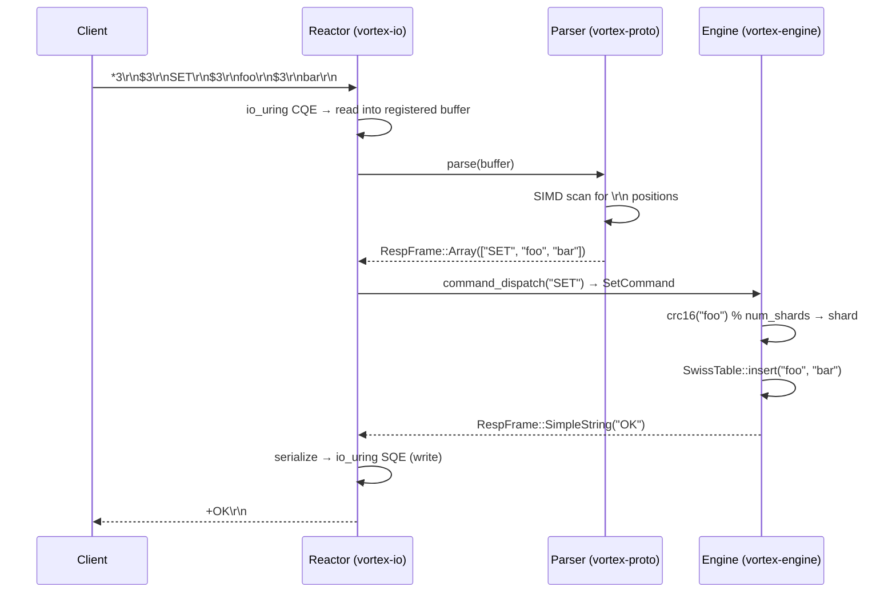

# VortexDB

[](https://github.com/kevincaicedo/vortex/actions/workflows/ci.yml)
[](LICENSE)

> Next-generation, Redis-compatible in-memory database written in Rust.

VortexDB is a high-performance, drop-in Redis replacement built from the ground up in Rust. It targets sub-100µs p99 latency at 1M+ ops/sec per core using a thread-per-core architecture, io_uring, SIMD-accelerated RESP parsing, and a cache-line-optimized Swiss Table hash map.

## Performance Targets

| Metric | Target |
|--------|--------|
| Throughput (single core) | ≥ 1M ops/sec |
| GET/SET p50 latency | < 10 µs |
| GET/SET p99 latency | < 100 µs |
| GET/SET p999 latency | < 500 µs |
| Memory overhead per key | < 80 bytes (64B entry + metadata) |
| Startup time (1M keys) | < 2 seconds |

## Architecture

### Crate Dependency Graph



### Request Lifecycle



## Prerequisites

- **Rust nightly** — pinned via `rust-toolchain.toml` (nightly-2026-03-15)
- **Linux** recommended for `io_uring` support; macOS uses `polling` fallback
- **cargo-fuzz** (optional) — for fuzzing: `cargo install cargo-fuzz`
- **cargo-deny** (optional) — for dependency audit: `cargo install cargo-deny`

### Linux (Ubuntu 24.04)

```sh
# Install Rust
curl --proto '=https' --tlsv1.2 -sSf https://sh.rustup.rs | sh
# The pinned nightly toolchain installs automatically on first build

# Linux headers (for io_uring, optional)
sudo apt-get install -y linux-headers-$(uname -r) liburing-dev
```

### macOS 15+

```sh
# Install Rust
curl --proto '=https' --tlsv1.2 -sSf https://sh.rustup.rs | sh
# No additional dependencies — uses polling fallback
```

## Quick Start

```sh
# Build everything
cargo build --workspace

# Run the server
cargo run --bin vortex-server

# Run all tests
cargo test --workspace

# Run benchmarks
cargo bench -p vortex-bench

# Lint
cargo clippy --workspace --all-targets -- -D warnings

# Format check
cargo fmt --check

# Dependency audit
cargo deny check

# Fuzz the RESP parser (requires cargo-fuzz)
cd fuzz && cargo fuzz run fuzz_resp_parser -- -max_total_time=60
```

## Crate Map

| Crate | Description | Status |
|---|---|---|
| `vortex-common` | Foundation types: keys (SSO), values, errors, TTL, timestamps | ✅ Phase 0 |
| `vortex-memory` | jemalloc global allocator, NUMA-aware arenas, buffer pool | ✅ Phase 0 |
| `vortex-sync` | Lock-free SPSC/MPSC queues, sharded counters, backoff | ✅ Phase 0 |
| `vortex-proto` | RESP2/RESP3 parser & serializer, command dispatch table | ✅ Phase 0 |
| `vortex-io` | Thread-per-core I/O reactor (io_uring / polling fallback) | 📋 Phase 1 |
| `vortex-config` | CLI args + TOML config + environment variables | ✅ Phase 0 |
| `vortex-engine` | Sharded key-value engine, Swiss Table, Command trait | ✅ Phase 0 |
| `vortex-persist` | AOF writer, VXF snapshots, RDB import | 📋 Phase 5 |
| `vortex-cluster` | Cluster topology, gossip, slot routing (16384 slots) | 📋 Phase 7 |
| `vortex-replication` | Leader-follower replication, PSYNC compat | 📋 Phase 6 |
| `vortex-pubsub` | Pub/Sub with cross-reactor message delivery | 📋 Phase 4 |
| `vortex-scripting` | Lua scripting engine (EVAL/EVALSHA) | 📋 Phase 8 |
| `vortex-acl` | Redis ACL-compatible access control | 📋 Phase 6 |
| `vortex-metrics` | Prometheus metrics, SLOWLOG, INFO command | 📋 Phase 4 |
| `vortex-server` | Server binary — startup, signal handling, shutdown | ✅ Phase 0 |
| `vortex-cli` | Interactive CLI client (rustyline REPL) | 📋 Phase 2 |
| `vortex-bench` | Criterion benchmarks, load generator, perf counters | ✅ Phase 0 |

## Project Structure

```
vortex/
├── crates/
│   ├── vortex-common/       # Foundation types & traits
│   ├── vortex-memory/       # Memory allocator
│   ├── vortex-sync/         # Lock-free primitives
│   ├── vortex-proto/        # RESP protocol
│   ├── vortex-engine/       # Data engine & commands
│   ├── vortex-io/           # I/O reactor
│   ├── vortex-config/       # Configuration
│   ├── vortex-persist/      # Persistence
│   ├── vortex-cluster/      # Clustering
│   ├── vortex-replication/  # Replication
│   ├── vortex-pubsub/       # Pub/Sub
│   ├── vortex-scripting/    # Scripting
│   ├── vortex-acl/          # Access control
│   ├── vortex-metrics/      # Observability
│   └── vortex-server/       # Server binary
├── tools/
│   ├── vortex-cli/          # CLI client
│   └── vortex-bench/        # Benchmarks & load generator
├── fuzz/                    # Fuzz targets & corpus
├── scripts/                 # Flamegraph & comparison scripts
└── .github/workflows/       # CI/CD pipelines
```

## License

Apache-2.0
