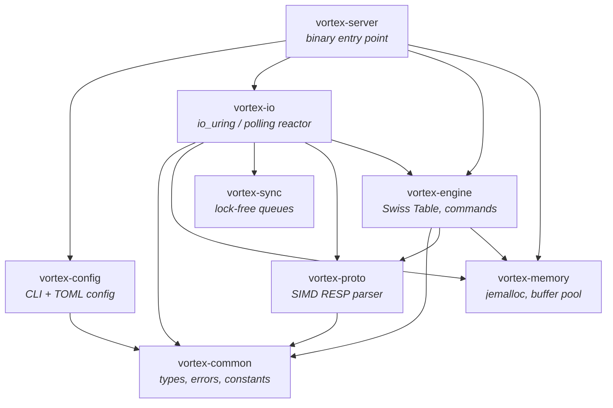

# VortexDB

[](https://github.com/kevincaicedo/vortex/actions/workflows/ci.yml)
[](LICENSE)

> Alpha-stage Redis-compatible in-memory database written in Rust. Built around thread-per-core reactors, Linux io_uring or cross-platform polling, SIMD parsing, and a Swiss Table engine.

VortexDB is a Redis-compatible in-memory data engine built from the ground up in Rust. It uses a thread-per-core reactor architecture, a shared concurrent keyspace, Linux io_uring when available, a cross-platform polling backend as the fallback/default portability path, SIMD-accelerated RESP parsing, and a Swiss Table hash map. Performance claims for the alpha release are evidence-gated; public numbers must come from the release evidence ledger, not from old single-run engineering snapshots.

## Benchmark Status

Benchmarking is active work for the alpha release. The current toolchain runs `redis-benchmark`, `memtier_benchmark`, and custom Rust workloads, then writes JSON/CSV/Markdown reports with workload contracts, repeat counts, backend mode, telemetry mode, memory attribution, and validity warnings.

Historical benchmark reports and methodology notes live in [docs/benchmarks.md](docs/benchmarks.md). Treat them as engineering evidence unless a row is explicitly marked release-grade by the active pre-release evidence ledger. Linux, macOS, Docker, polling, and io_uring rows are separate evidence surfaces and must not be mixed into one public claim.

## Performance Design

| Technique | Impact |
|-----------|--------|
| **Thread-per-core reactors** | Keeps socket, parser, write, and maintenance work local to a reactor while sharing a typed concurrent keyspace. |
| **Linux io_uring backend** | Available on Linux when the feature and kernel support it; release use is gated by correctness, fairness, and same-workload evidence. |
| **Cross-platform polling backend** | Portable fallback path used for macOS and generic Unix validation through the `polling` crate. |
| **SIMD RESP parser and SWAR dispatch** | Keeps parser and command lookup work compact; malformed-frame and boundary coverage remain release gates. |
| **Swiss Table engine** | Uses grouped probing and explicit memory accounting; table payload and memory-footprint work remains a pre-release gate. |
| **Minimal telemetry mode** | Default release path avoids profile-only phase timers; profiling builds can enable more expensive diagnostics. |
| **jemalloc integration** | Provides allocator stats and purge hooks; per-reactor arena policy remains experiment-gated. |

## Quick Start

### Build & Run

```sh
# Clone and build
git clone https://github.com/vortexdb/vortex.git
cd vortex
cargo build --release --bin vortex-server

# Start the server (default: 127.0.0.1:6379)
./target/release/vortex-server

# Connect with any Redis client
redis-cli -p 6379
> SET hello world
OK
> GET hello
"world"
```

### Docker

```sh
# Build production image (~52 MB)
docker build -t vortexdb:latest .

# Run
docker run -p 6379:6379 vortexdb:latest
```

### Using Just (Recommended)

```sh
cargo install just

just build          # Build workspace
just test           # Run all 485 tests
just clippy         # Lint check
just bench          # Run 69 Criterion benchmarks
just miri           # Memory safety checks (~42s)
just compare        # Competitive benchmark vs Redis/Dragonfly/Valkey
just compare-memtier # Point workloads + memtier mixed workloads
just compare-docker # containerized Competitive benchmark
just compare-full   # CI-style benchmark report with JSON/Markdown output
```

## Supported Commands (55)

VortexDB v0.1-alpha implements all Redis String and Key commands — everything needed for key-value caches, session stores, and counters.

**String (20):** GET, SET, SETNX, SETEX, PSETEX, MGET, MSET, MSETNX, GETSET, GETDEL, GETEX, GETRANGE, SETRANGE, INCR, DECR, INCRBY, DECRBY, INCRBYFLOAT, APPEND, STRLEN

**Key (20):** DEL, UNLINK, EXISTS, EXPIRE, PEXPIRE, EXPIREAT, PEXPIREAT, PERSIST, TTL, PTTL, EXPIRETIME, PEXPIRETIME, TYPE, RENAME, RENAMENX, KEYS, SCAN, RANDOMKEY, TOUCH, COPY

**Server (15):** PING, ECHO, QUIT, DBSIZE, FLUSHDB, FLUSHALL, INFO, COMMAND, SELECT, TIME, MULTI, EXEC, DISCARD, WATCH, UNWATCH

Full compatibility matrix: [docs/compatibility.md](docs/compatibility.md)

## Architecture

VortexDB is a 17-crate Rust workspace with strict layered dependencies.


```mermaid
graph TD
    common[vortex-common<br><i>types, errors, constants</i>]
    memory[vortex-memory<br><i>jemalloc, buffer pool</i>]
    sync[vortex-sync<br><i>lock-free queues</i>]
    proto[vortex-proto<br><i>SIMD RESP parser</i>]
    engine[vortex-engine<br><i>Swiss Table, commands</i>]
    io[vortex-io<br><i>io_uring / polling reactor</i>]
    config[vortex-config<br><i>CLI + TOML config</i>]
    server[vortex-server<br><i>binary entry point</i>]

    proto --> common
    engine --> common
    engine --> proto
    engine --> memory
    io --> common
    io --> memory
    io --> sync
    io --> proto
    io --> engine
    config --> common
    server --> config
    server --> io
    server --> engine
    server --> memory
```

**Request path:** Client -> backend completion/event -> SIMD RESP parse -> SWAR command dispatch -> Swiss Table probe -> RESP response -> writev or io_uring writev

Full architecture guide: [docs/architecture.md](docs/architecture.md)

## Documentation

| Document | Description |
|----------|-------------|
| [Architecture Guide](docs/architecture.md) | Crate map, data flow, threading model, memory layout |
| [Command Compatibility](docs/compatibility.md) | Every Redis command: implemented, planned, or won't-implement |
| [Benchmark Methodology](docs/benchmarks.md) | Hardware specs, tools, how to reproduce, full results |
| [Migration Guide](docs/migration.md) | Step-by-step Redis → VortexDB migration |
| [Configuration Reference](docs/configuration.md) | All CLI flags, env vars, TOML options with defaults |
| [Contributing](CONTRIBUTING.md) | Development workflow, testing, CI, code standards |

## Prerequisites

- **Rust nightly** — pinned via `rust-toolchain.toml` (nightly-2026-03-15)
- **Linux** recommended for `io_uring` support; macOS uses the cross-platform polling backend
- **redis-cli** / **redis-benchmark** / **memtier_benchmark** — for client testing and benchmarks

```sh
# Install Rust (nightly auto-selected on first build)
curl --proto '=https' --tlsv1.2 -sSf https://sh.rustup.rs | sh

# Linux: io_uring headers (optional)
sudo apt-get install -y liburing-dev

# macOS: no additional deps needed
```

## Project Structure

```
vortex/
├── crates/
│   ├── vortex-common/       # Foundation types (VortexKey, VortexValue, errors)
│   ├── vortex-memory/       # jemalloc, mmap buffer pool, arena allocator
│   ├── vortex-sync/         # Lock-free SPSC/MPSC, sharded counters
│   ├── vortex-proto/        # SIMD RESP2/RESP3 parser & serializer
│   ├── vortex-engine/       # Swiss Table, shard, 55 command handlers
│   ├── vortex-io/           # Thread-per-core reactor (io_uring/polling)
│   ├── vortex-config/       # CLI + TOML + env configuration
│   ├── vortex-persist/      # AOF; VXF snapshots planned
│   ├── vortex-cluster/      # Cluster protocol, gossip (planned)
│   ├── vortex-replication/  # Leader-follower replication (planned)
│   ├── vortex-pubsub/       # Pub/Sub (planned)
│   ├── vortex-scripting/    # Lua scripting (planned)
│   ├── vortex-acl/          # Access control (planned)
│   ├── vortex-metrics/      # Metrics support surfaces
│   └── vortex-server/       # Server binary entry point
├── tools/
│   ├── vortex-cli/          # Interactive CLI client
│   └── vortex-bench/        # 69 Criterion benchmarks
├── fuzz/                    # cargo-fuzz targets & corpus
├── scripts/                 # Benchmark & flamegraph scripts
├── docs/                    # Architecture, compatibility, benchmarks, migration
└── .github/workflows/       # CI (test, clippy, miri, asan, tsan, bench)
```

## License

Apache-2.0
