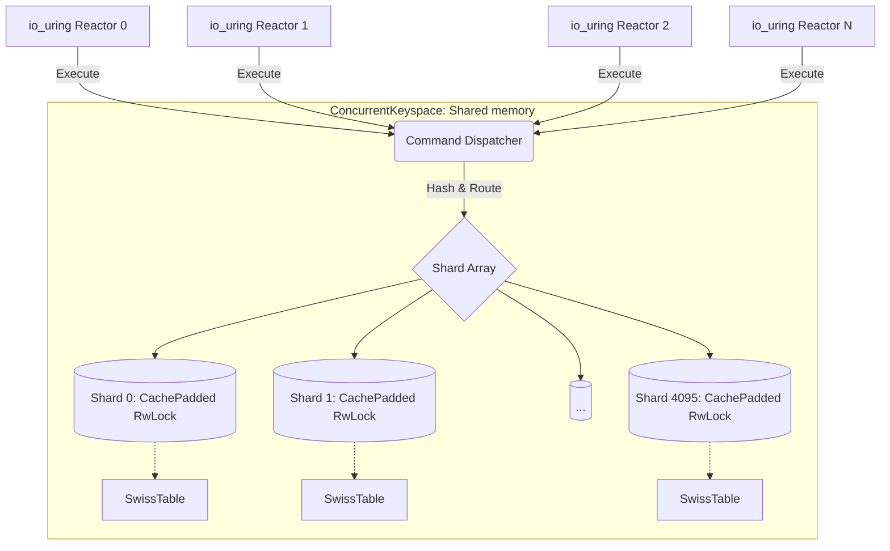

# Vortex Engine Architecture Overview

The `vortex-engine` crate is the ultra-high-performance heart of VortexDB. It replaces the classic, single-threaded dictionary of Redis with a completely reimagined **Thread-Per-Core Shared Concurrent Keyspace**.

## Core Philosophy

Redis 8 and Valkey single-thread the execution of their data engine, leaving >98% of modern server CPUs underutilized or relying solely on I/O threads to boost networking. In contrast, DragonflyDB uses shared-nothing fibers, resulting in expensive cross-actor coordination for multi-key workloads.

**Vortex Engine** uses an entirely differently paradigm: **M2 ShardedRwLock**, which combines maximum mechanical sympathy, thread-per-core io_uring reactors, and a highly concurrent keyspace. 

## The Engine Pillars

### 1. ConcurrentKeyspace
Instead of locking the entire database, or running isolated shards per-thread, VortexDB shares a single `ConcurrentKeyspace` across all execution threads.
* **4096 Shards:** By default, the keyspace is split into thousands of shards. 
* **RwLock Arrays:** `parking_lot::RwLock` governs access to each shard. Since 4096 shards drastically outnumber the amount of CPU cores, contention drops to near `0.02%` per operation. You can process millions of reads concurrently. 
* **Deadlock-Free Lock Acquisition:** Multi-key operations (like `MSET` / `MGET`) sort their targets and lock shards in strictly ascending order.

### 2. SIMD-Probed SwissTable
Inside each cache-padded shard lies a **SwissTable**. 
* Unlike Redis's separate chaining dictionary, Vortex uses open-addressing with SIMD-powered triangular probing.
* Each "probe group" contains 16 control bytes. A single CPU instruction (AVX2 / NEON) checks 16 slots simultaneously.

### 3. Cache-Line Inline Memory Layout (64-Bytes)
Every element in the SwissTable is represented by a `vortex_engine::Entry`.
* Designed to perfectly fill a **64-byte L1 Cache Line**.
* Small keys (≤ 23 bytes) and small values (≤ 21 bytes) are stored completely **inline** alongside their TTL and H2 metadata. No pointer chasing required.

### 4. Zero-Allocation Command Dispatch
Commands are mapped from RESP payloads and executed purely against the Keyspace via hardcoded routing `src/commands/mod.rs`. Everything is zero-allocation: arguments are sliced from the io_uring buffers directly, minimizing allocations.

## How It Works in Practice

When a client sends a `GET foo` command:
1. An io_uring reactor parses it using AVX2.
2. The `ConcurrentKeyspace` computes the `ahash` of `foo`.
3. It determines the shard: `hash & 4095`.
4. It grabs a fast, uncontended `RwLock::read()`, which costs ~15 nanoseconds.
5. Inside the lock, the `SwissTable` uses SIMD to immediately retrieve the inline 64-byte `Entry`.
6. The data is sliced and sent directly back as a `Static` or `Inline` response. No heap allocation, no OS context-switch overhead.
