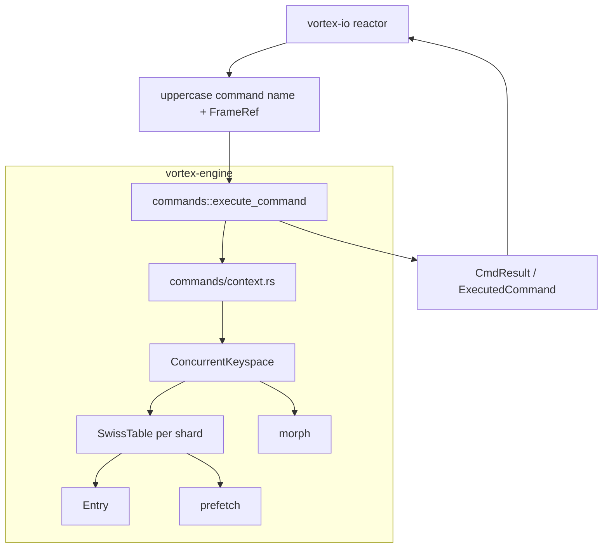
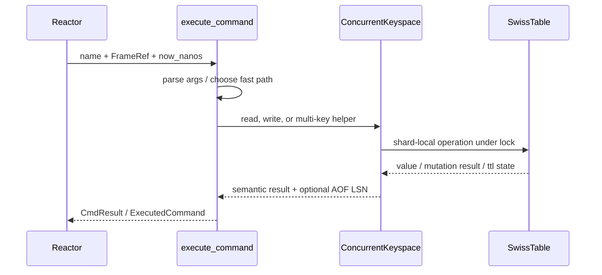

# Vortex Engine Crate Overview

`vortex-engine` is the in-memory execution core of VortexDB. It owns data layout, shard topology, TTL semantics, command semantics, and memory accounting. It does **not** own sockets, event loops, or RESP parsing. Those concerns live outside the crate.

That separation is the first architectural rule to understand:

- `vortex-io` owns connections, reactors, and writeback
- `vortex-proto` owns RESP parsing, command metadata, and serialization helpers
- `vortex-engine` owns the data engine itself

The engine takes already-parsed commands and executes them against a shared concurrent keyspace.

## Crate Boundary

At the top of the crate, the public surface is intentionally small:

- `ConcurrentKeyspace` is the shared database
- `SwissTable` is the per-shard storage engine
- `Entry` is the 64-byte slot layout
- `eviction` owns runtime maxmemory policy state and LFU frequency tracking helpers
- `morph` and `prefetch` provide support for adaptive behavior and cache hints

From the point of view of the caller, the hot contract is effectively:

```text
uppercase command name + FrameRef + now_nanos + ConcurrentKeyspace -> CmdResult / ExecutedCommand
```

The engine never asks the OS for time on the hot path. The caller supplies `now_nanos`, which keeps TTL decisions consistent across one reactor iteration and avoids repeated system clock reads.

## Module Map



Module responsibilities:

- `commands/`: static dispatch, argument decoding, result shaping, and command-specific semantics
- `keyspace.rs`: shard topology, lock acquisition, memory counters, TTL-key counters, global LSN, and eviction control
- `table.rs`: SIMD-probed SwissTable implementation for one shard
- `entry.rs`: 64-byte slot format used by the table
- `eviction.rs`: runtime eviction policy enum, config state, frequency sketch, and RNG helpers
- `morph.rs`: access-profile packing and future adaptive structure decisions
- `prefetch.rs`: platform-specific read/write prefetch helpers used by selected batch paths

## Architecture Layers

The crate is easiest to understand as three stacked layers.

### 1. Command Layer

The command layer lives in `commands/`.

It is responsible for:

- static match-based dispatch in `commands/mod.rs`
- lightweight argument extraction from `FrameRef`
- Redis-compatible option parsing and semantic decisions
- shaping responses as `Static`, `Inline`, or full `RespFrame`
- returning an optional AOF LSN for mutation commands

This layer does not manage raw pointers or lock arrays directly. It delegates storage access to `ConcurrentKeyspace` methods implemented in `commands/context.rs`.

### 2. Concurrency Layer

`ConcurrentKeyspace` is the ownership and coordination layer.

It is responsible for:

- routing keys to shards
- acquiring one or many shard locks in a deadlock-free order
- tracking per-shard TTL counts
- publishing approximate global memory usage
- allocating global logical sequence numbers for mutations
- exposing shard-scoped maintenance operations such as active expiry and scans

This is the layer that turns Redis-style commands into safe concurrent operations.

### 3. Storage Layer

Each shard contains one `SwissTable`.

That layer is responsible for:

- hashing within the shard table
- control-byte probing and slot lookup
- inline vs heap-spill entry encoding
- resize and tombstone management
- per-table local memory accounting
- per-entry TTL storage and lazy-expiry helpers

This is the layer documented in depth in [03-swiss-table-layout.md](03-swiss-table-layout.md).

## Core Request Lifecycle

Most requests follow the same pipeline.



Concrete stages:

1. Upstream code normalizes the command name to uppercase ASCII.
2. `execute_command` selects the handler with a static `match`.
3. The handler uses either a fast path or `CommandArgs::collect`.
4. The handler calls a `ConcurrentKeyspace` helper.
5. `ConcurrentKeyspace` selects the shard or set of shards, acquires the required lock topology, and calls into one or more `SwissTable`s.
6. The handler converts the result into a wire-oriented response type.
7. For mutations, the engine may also return an AOF LSN so persistence layers can order writes correctly.

## Why The Shared Keyspace Matters

Vortex does not use a shared-nothing actor model inside the engine crate. It uses one shared keyspace split into many independently locked shards.

That decision drives several downstream properties:

- single-key commands are cheap because they touch exactly one shard lock
- multi-key commands can still be implemented inside the engine without cross-thread RPC
- reads on unrelated shards proceed concurrently
- cross-shard coordination remains explicit and deterministic instead of being hidden in mailbox traffic

The keyspace is therefore not just a container. It is the concurrency policy of the engine.

## Cross-Cutting Systems

Several concerns appear across multiple modules.

### TTL And Expiry

- `Entry` stores the absolute TTL deadline
- `SwissTable` exposes TTL-aware table methods
- `ConcurrentKeyspace` tracks per-shard counts of keys with TTLs
- command helpers implement lazy cleanup with read-to-write lock escalation when a stale key is encountered

TTL is not a side structure bolted on later. It is integrated through the whole call chain.

### Memory Accounting

- `SwissTable` tracks exact `local_memory_used` and buffered `local_memory_drift`
- `ShardWriteGuard` flushes buffered drift to the global counter when the write lock is dropped
- `ConcurrentKeyspace` exposes `memory_used()` for exact totals and `approx_memory_used()` for fast approximate totals

This gives the engine exact per-shard accounting without paying an atomic update on every mutation.

### Global Mutation Ordering

Mutation commands can allocate a global LSN from `ConcurrentKeyspace::next_lsn()`.

That LSN is used by higher layers for AOF ordering and recovery. The engine itself does not write AOF files, but it is the source of the mutation order used by persistence.

### Eviction And Frequency Tracking

- `Entry.flags` stores a 4-bit Morris counter used by clock-sweep second chances without increasing the 64-byte slot size
- `ConcurrentKeyspace` owns the runtime `maxmemory` / policy state, per-shard `clock_hands`, and the `ensure_memory_for(...)` admission boundary used by mutating growth paths
- `eviction::FrequencySketch` provides the global LFU frequency estimate as a flat 4 × 2048 Count-Min Sketch with periodic half-decay
- read hits and successful writes feed the LFU sketch through the same access hook that updates entry-local counters

This is where the engine's mechanical-sympathy story becomes concrete: eviction does not maintain linked lists, global LRU queues, or per-entry heap nodes. It stays on top of the existing array-backed SwissTable layout, uses one tiny global sketch, and keeps victim selection inside the shard-local sweep while the write lock is already held.

### Prefetch And Adaptive Hooks

- `prefetch.rs` provides explicit read/write prefetch helpers for batch table operations
- `morph.rs` stores `AccessProfile` metadata inside `Entry::_pad0` without increasing entry size

These are support systems that let the engine grow into more adaptive data-structure choices without changing the core request pipeline.

## What The Crate Does Not Do

This is just as important as what it does do.

`vortex-engine` does not:

- accept TCP connections
- parse sockets or schedule event loops
- serialize bytes onto the wire itself
- own AOF files or fsync policy
- implement client state machines

Those boundaries keep the engine testable and mechanically focused. Unit tests can exercise command semantics and data-structure behavior without bringing in the network stack.

## Reading Order For The Docs Set

The docs are intended to read from outside to inside:

1. this file for the crate-level shape
2. [02-concurrent-keyspace.md](02-concurrent-keyspace.md) for concurrency topology
3. [03-swiss-table-layout.md](03-swiss-table-layout.md) for per-shard storage
4. [04-command-execution.md](04-command-execution.md) for the execution pipeline

