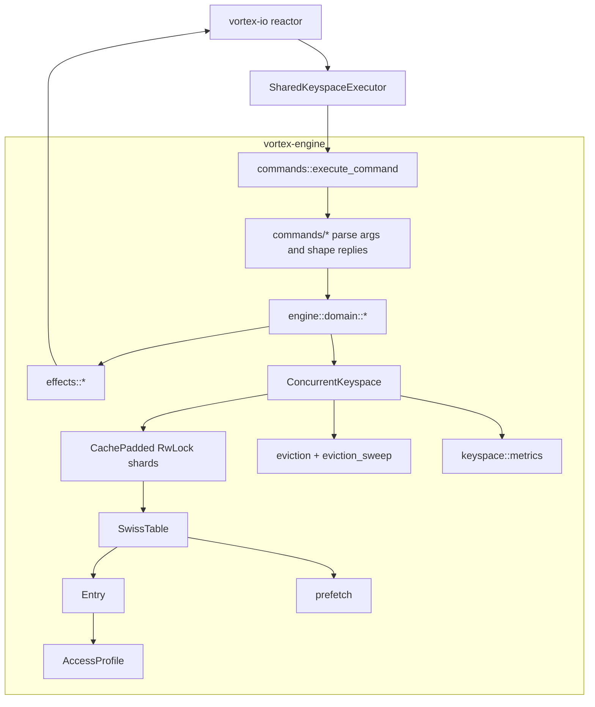
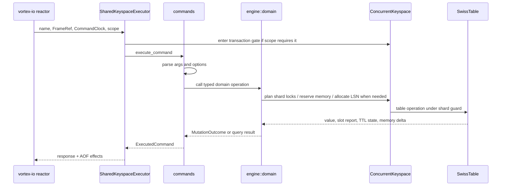
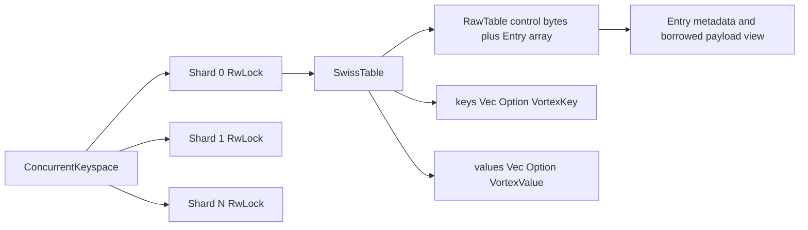

# Vortex Engine Crate Overview

`vortex-engine` is the in-memory execution core of VortexDB. It owns Redis-compatible command semantics, the shared keyspace, shard-level hash tables, entry metadata, TTL, WATCH-visible versions, eviction policy, memory admission, and engine-owned runtime metrics.

It deliberately does not own sockets, event loops, kernel I/O, RESP parsing from byte streams, AOF file formats, or fsync policy. Those concerns live in sibling crates:

- `vortex-io`: reactors, connections, parser scheduling, write lifetimes, transaction queues, WATCH connection state, and AOF writer coordination.
- `vortex-proto`: RESP frame/tape parsing and frame representation.
- `vortex-persist`: append-only file format, replay, rewrite, fsync, truncation, and crash recovery.
- `vortex-common`: shared key/value types, timestamp helpers, encoding enums, and constants.

The engine receives a parsed RESP frame, an uppercase command name, and a caller-supplied clock. It returns a response plus typed mutation effects for the reactor to persist or write back.

## Terms

This docs set uses these terms consistently:

- RESP: Redis Serialization Protocol, the wire format used by Redis-compatible clients.
- TTL: time to live. In Vortex this is stored as an absolute monotonic nanosecond deadline. `0` means no expiry.
- LSN: logical sequence number. This is the engine mutation version used for WATCH validation and AOF ordering.
- AOF: append-only file. The engine creates typed commit metadata, but `vortex-persist` owns the file format and durability contract.
- shard: one independently locked partition of the keyspace.
- SwissTable: the per-shard open-addressing hash table that probes groups of control bytes before touching full entries.
- control byte: one byte per table slot that says empty, deleted, or occupied with a short hash fingerprint.
- tombstone: a deleted slot marker that keeps probe chains valid until resize.
- Morris counter: a probabilistic saturating counter used as cheap per-entry eviction metadata.

## Public Surface

The crate root re-exports the public types most callers need:

| Type | Role |
| --- | --- |
| `ConcurrentKeyspace` | Shared sharded database and engine coordination layer. |
| `SharedKeyspaceExecutor` | Concrete command executor used by reactors in the alpha shared-keyspace topology. |
| `SwissTable` | Per-shard storage table. Public for focused tests, probes, and lower-level engine work. |
| `Entry` | 64-byte cache-line-aligned slot metadata and compact payload view. Its raw fields are private. |
| `EvictionConfig` / `EvictionPolicy` | Runtime maxmemory and eviction policy contract. |
| `AofCommitEffect`, `AofRecord`, `AofRecords` | Typed persistence effects returned by mutations. |
| `AccessProfile` and morph monitors | Entry-resident adaptive-structure metadata and future morphing policy hooks. |

Most production callers should enter through `SharedKeyspaceExecutor::execute_scoped` or `commands::execute_command`, not by mutating `SwissTable` directly.

## Current Module Map


```mermaid
flowchart TD
    Reactor[vortex-io reactor] --> Executor[SharedKeyspaceExecutor]
    Executor --> Dispatch[commands::execute_command]

    subgraph Engine["vortex-engine"]
        Dispatch --> CommandModules["commands/* parse args and shape replies"]
        CommandModules --> Domain["engine::domain::*"]
        Domain --> Effects["effects::*"]
        Domain --> Keyspace[ConcurrentKeyspace]
        Keyspace --> Shards["CachePadded RwLock shards"]
        Shards --> Table[SwissTable]
        Table --> Entry[Entry]
        Keyspace --> Eviction[eviction + eviction_sweep]
        Keyspace --> Metrics[keyspace::metrics]
        Entry --> Morph[AccessProfile]
        Table --> Prefetch[prefetch]
    end

    Effects --> Reactor
```

Module responsibilities:

| Module | Responsibility |
| --- | --- |
| `commands/` | Static command dispatch, argument extraction, Redis-compatible option parsing, RESP reply shaping, AOF command payload encoding. |
| `engine::domain` | Zero-cost command-domain operations over the keyspace: lock choice, mutation coordination, TTL transitions, memory admission, WATCH invalidation, eviction effects, and LSN stamping. |
| `effects.rs` | Typed side-effect vocabulary shared with reactor/persistence coordination. |
| `executor.rs` | Concrete executor boundary for the current shared-keyspace architecture and future executor/router experiments. |
| `keyspace.rs` and `keyspace/*` | Sharding, sorted lock acquisition, transaction gates, WATCH state, LSN allocation, memory admission, TTL counters, eviction maintenance, runtime metrics, and memory attribution. |
| `table.rs` | SwissTable probing, insert/update/delete, tombstone reuse, resize, prehashed batch APIs, slot cursors, and table allocation accounting. |
| `entry.rs` | 64-byte entry layout, key/value metadata encoding, TTL deadline, 48-bit version storage, Morris count, and access profile storage. |
| `eviction.rs` | Eviction policy enum, packed config state, LFU frequency sketch, and random sampling helpers. |
| `morph.rs` | `AccessProfile` bit packing and morph-monitor hooks. Current code tracks metadata; most adaptive transitions are future work. |
| `prefetch.rs` | Safe wrappers around platform prefetch hints used by selected batch paths. |

## Layer Boundaries

The current alpha boundary is:

```text
vortex-io
  owns sockets, connection state, parser scheduling, transaction queues,
  response lifetimes, AOF writer handoff, and reactor budgets

vortex-engine::commands
  owns command-name dispatch, RESP argument interpretation, Redis-compatible
  errors, response shaping, and AOF payload encoding

vortex-engine::engine::domain
  owns typed key/value operations, memory reservation, revalidation,
  mutation effects, WATCH/AOF/TTL/eviction coordination, and table calls

vortex-engine::keyspace
  owns shard routing, lock ordering, transaction gates, WATCH registries,
  LSN allocation, TTL counters, eviction state, metrics, and memory attribution

vortex-engine::table
  owns slot lookup, probing, tombstones, resize, payload owner arrays,
  table-local memory accounting, and entry publication

vortex-engine::entry
  owns slot-resident metadata and compact borrowed payload representation
```

The important rule is direction of knowledge: upper layers may ask lower layers to perform typed operations, but lower layers must not know RESP syntax, connection state, or kernel I/O.

## Request Lifecycle


```mermaid
sequenceDiagram
    participant IO as vortex-io reactor
    participant Exec as SharedKeyspaceExecutor
    participant Cmd as commands
    participant Dom as engine::domain
    participant KS as ConcurrentKeyspace
    participant Table as SwissTable

    IO->>Exec: name, FrameRef, CommandClock, scope
    Exec->>KS: enter transaction gate if scope requires it
    Exec->>Cmd: execute_command
    Cmd->>Cmd: parse args and options
    Cmd->>Dom: call typed domain operation
    Dom->>KS: plan shard locks / reserve memory / allocate LSN when needed
    KS->>Table: table operation under shard guard
    Table-->>Dom: value, slot report, TTL state, memory delta
    Dom-->>Cmd: MutationOutcome or query result
    Cmd-->>Exec: ExecutedCommand
    Exec-->>IO: response + AOF effects
```

The caller supplies `CommandClock`, currently containing monotonic and Unix nanosecond values. Monotonic time drives TTL deadlines inside the engine. Unix time is used only when a Redis command uses wall-clock options such as `EXAT`, `PXAT`, `EXPIRETIME`, `PEXPIRETIME`, or `TIME`.

## Data Ownership

The hot storage path has three nested owners:


```mermaid
flowchart LR
    KS[ConcurrentKeyspace] --> S0[Shard 0 RwLock]
    KS --> S1[Shard 1 RwLock]
    KS --> SN[Shard N RwLock]
    S0 --> T0[SwissTable]
    T0 --> R[RawTable control bytes plus Entry array]
    T0 --> K[keys Vec Option VortexKey]
    T0 --> V[values Vec Option VortexValue]
    R --> E[Entry metadata and borrowed payload view]
```

`Entry` is not the only owner of key/value data. The table owns full `VortexKey` and `VortexValue` instances in parallel slot arrays. Each `Entry` stores inline small bytes when possible and borrowed pointer metadata into those slot owners when data is heap backed. The table rewrites entry metadata after insert, overwrite, and resize so those borrowed views stay valid.

## Cross-Cutting Systems

### TTL And Expiry

`Entry` stores the deadline. `SwissTable` exposes TTL-aware lookup and mutation helpers. `ConcurrentKeyspace` maintains per-shard and global counts of keys with TTLs. Domain operations publish `ExpiryTransition` effects after dropping shard guards. Reactors can run bounded active-expiry maintenance by calling `run_active_expiry_on_shard`.

### LSN And WATCH

The keyspace owns one global `AtomicU64` LSN counter. Mutations allocate entry-visible LSNs only when WATCH or AOF recording needs them. Featureless writes can skip the global LSN atomic. Present-key WATCH validation reads the entry LSN directly. Absent-key WATCH validation uses a cold sharded registry because there is no entry to stamp.

### Memory Admission

`SwissTable` tracks exact shard-local logical dataset bytes and buffered drift. `ShardWriteGuard` flushes drift to the global approximate counter on drop. Maxmemory admission uses a reservation counter so concurrent writers cannot all pass against the same stale published memory value.

### Eviction

Eviction lives in the keyspace because it needs global policy, per-shard clock hands, memory pressure, TTL knowledge, WATCH invalidation, and optional AOF records. It does not maintain Redis-style linked lists. It sweeps table slots in bounded windows and uses entry-local Morris counters plus a small global LFU sketch when LFU policies are active.

### Runtime Metrics

The engine owns low-overhead runtime counters that IO updates through the keyspace. Minimal release mode keeps health, backend, memory, AOF, overload, expiry, and eviction counters available. Profile timers stay behind the `profile-telemetry` feature and profiling builds.

## Read The Docs In This Order

1. [01-architecture-overview.md](01-architecture-overview.md): crate shape and module boundaries.
2. [02-concurrent-keyspace.md](02-concurrent-keyspace.md): shards, locks, WATCH, LSN, TTL, memory, eviction, and metrics.
3. [03-swiss-table-layout.md](03-swiss-table-layout.md): table groups, control bytes, probing, entry layout, bit operations, and memory layout.
4. [04-command-execution.md](04-command-execution.md): command dispatch, domain mutations, deferred effects, hot paths, and batch paths.
5. [05-integration-and-transactions.md](05-integration-and-transactions.md): reactor integration, transaction gates, WATCH/MULTI/EXEC ownership, AOF handoff, and maintenance.
6. [metrics.md](metrics.md) and [profiling.md](profiling.md): release metrics and profile-only metrics.

For a deeper internal tutorial, see `learn/vortex-engine-design.md` at the repository root.
