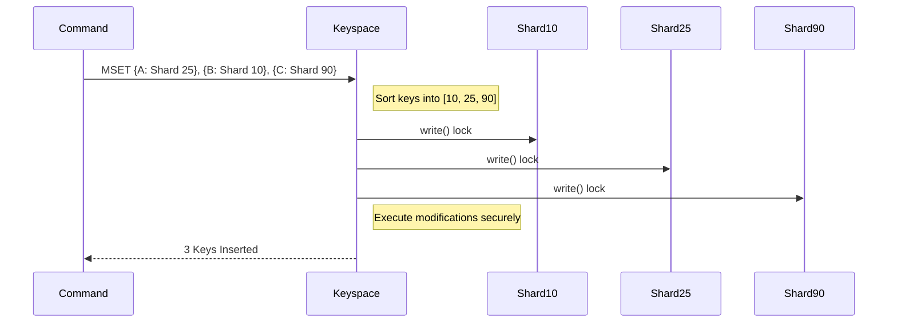

# Concurrent Keyspace

The `ConcurrentKeyspace` in VortexDB is the absolute barrier that manages and regulates multithreaded runtime behaviors. Rather than complex intent-based locking (VLL) or thread-isolated messaging systems, it implements an **M2 ShardedRwLock Architecture**.

## How the Keyspace is Organized

When `ConcurrentKeyspace::new(4096)` is evaluated at startup, it spawns a highly optimized array of locks mapping over the database content.
The keyspace takes advantage of `crossbeam_utils::CachePadded` to prevent CPU false sharing on the L1/L2/L3 cache lines.

```rust
type Shard = CachePadded<RwLock<SwissTable>>;
```

Padding the lock to 128-bytes ensures that two threads, writing to `Shard 5` and `Shard 6` respectively, will never trip the hardware caching synchronization penalty (which usually stalls processors for hundreds of cycles if locks exist in the same memory sector). 

## Shard Routing

To determine which `Shard` owns a specific piece of data, VortexDB uses `ahash::RandomState` acting across the keys bytes, immediately bitmasked:
```rust
pub fn shard_index(&self, key: &[u8]) -> usize {
    (self.hasher.hash_one(key) & self.mask) as usize
}
```
Using `& mask` is only algorithmically valid when the number of shards is a power of two. This replaces an expensive modulo division step on the hot path, shaving off roughly `~3ns` of processor overhead per command over traditional modulus math (`%`).

## Multi-Key Operations and Deadlock Prevention

The difficulty with shared keyspaces is handling operations that touch multiple items smoothly, without freezing if Thread A grabs lock X, expects lock Y, and Thread B grabs lock Y and expects lock X. This is known as a lock cycle deadlock.

Vortex prevents deadlocks entirely by requiring strict sorting of acquired locks.

When handling an `MGET`, `MSET`, or `EXEC` command:
1. The keys are hashed to determine their shard indices.
2. The code generates a deduplicated set of the needed shards.
3. The table enforces an acquiring sequence of locks in **strictly ascending index order**.
4. To match keys back to their acquired lock guards (for getting and setting the values), it searches through the array sequentially using an optimized `binary_search`.
5. Because the locks were sorted and deduped from the keys, the binary search is mathematically proven by Kani proofs `verify_binary_search_always_finds` to never fail natively, avoiding a bounds-checking panic or fallback layout.



## Global Logical Sequence Number (LSN)

As a fundamental layer of Phase 5 shadow paging and AOF epoch-tracking, the keyspace holds a `AtomicU64` referred to as the LSN. While inside a shard's `write()` cycle, modifications to records generate causality.
By calling `self.next_lsn()` inside the already secure write block, VortexDB produces a guaranteed linear ordering of database changes without requiring a separate "global write barrier" slowing down throughput.
