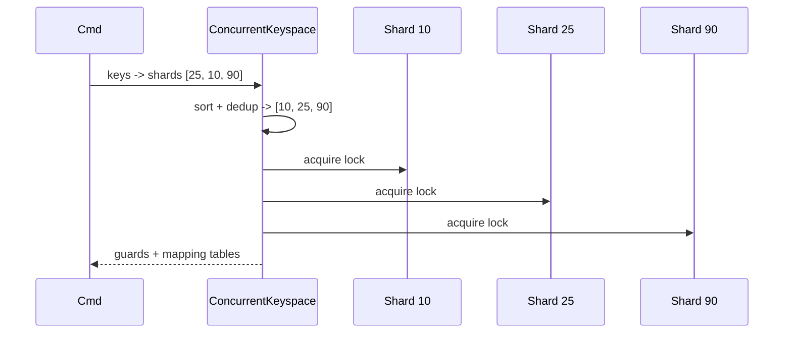

# ConcurrentKeyspace Deep Dive

`ConcurrentKeyspace` is the concurrency control plane of `vortex-engine`. It owns the shard array, decides how keys map to shards, acquires locks for single-key and multi-key operations, tracks global counters, and exposes maintenance operations such as scans and active expiry.

If `SwissTable` is the per-shard storage engine, `ConcurrentKeyspace` is the system that makes many `SwissTable`s behave like one database.

## Internal Layout

At a high level the type looks like this:

```mermaid
flowchart TD
    KS[ConcurrentKeyspace]
    KS --> S[shards: Box<[CachePadded<RwLock<SwissTable>>]>]
    KS --> C[clock_hands: Box<[CachePadded<AtomicUsize>]>]
    KS --> E[expiry_key_count: Box<[CachePadded<AtomicUsize>]>]
    KS --> M[mask]
    KS --> H[hasher]
    KS --> TH[table_hasher]
    KS --> GM[global_memory_used]
    KS --> GL[global_lsn]
    KS --> EV[eviction: EvictionConfigState]
    KS --> FS[frequency_sketch: FrequencySketch]
```

These fields divide into six jobs:

- data ownership: `shards`
- eviction cursor state: `clock_hands`
- TTL metadata: `expiry_key_count`
- routing: `mask`, `hasher`, `table_hasher`
- global bookkeeping: `global_memory_used`, `global_lsn`
- runtime policy state: `eviction`
- LFU frequency estimation: `frequency_sketch`

## Shard Topology

Each shard is:

```rust
type Shard = CachePadded<RwLock<SwissTable>>;
```

Important invariants:

- shard count must be a power of two
- shard count must be in `[64, 131072]`
- default shard count is `4096`

Why `CachePadded` matters:

- adjacent locks do not share a cache line
- one hot shard lock does not cause false sharing with its neighbor
- lock metadata remains isolated under heavy parallel access

Why `RwLock<SwissTable>` matters:

- read-heavy commands can share a shard read lock
- write commands still serialize per shard
- unrelated shards proceed independently

The design is not lock-free. It is deliberately sharded so that the lock scope stays narrow and predictable.

## Two Hashers, Two Jobs

One subtle but important part of `ConcurrentKeyspace` is that it keeps **two** hashers.

### `hasher`: Shard Routing Hasher

`hasher` uses fixed seeds.

That gives deterministic shard routing across process restarts:

```rust
pub fn shard_index(&self, key: &[u8]) -> usize {
    (self.hasher.hash_one(key) & self.mask) as usize
}
```

The `& self.mask` operation is valid because the shard count is a power of two. It is a fast modulo replacement on the routing hot path.

### `table_hasher`: Per-Table Hashing Hasher

`table_hasher` is cloned into every `SwissTable` in the keyspace.

That solves a different problem: command handlers often want to compute the table hash **before** acquiring a shard lock, then pass that precomputed hash down into the table operation. Keeping one shared table-hash policy for the whole keyspace allows that optimization without exposing random per-table state to callers.

In short:

- `hasher` decides *which shard*
- `table_hasher` decides *where inside that shard's SwissTable*

## Single-Key Access Paths

The keyspace exposes direct lock acquisition helpers:

- `read_shard(key)`
- `write_shard(key)`
- `read_shard_by_index(idx)`
- `write_shard_by_index(idx)`

It also exposes closure-based helpers:

- `read(key, |table| ...)`
- `write(key, |table| ...)`

These are useful for keeping data conversion outside the lock and limiting the critical section to the actual table operation.

### Why `unsafe get_unchecked` Appears Here

The code uses `unsafe { self.shards.get_unchecked(idx) }` on hot paths.

That is safe because:

- `idx` is derived from `hash & mask`
- `mask == num_shards - 1`
- `num_shards` is a power of two

So `idx < shards.len()` is guaranteed by construction.

## `ShardWriteGuard`: Flushing Memory Drift On Drop

Write guards are wrapped in `ShardWriteGuard` instead of exposing `RwLockWriteGuard<SwissTable>` directly.

That wrapper exists for one reason:

- when a shard write guard is dropped, it calls `SwissTable::flush_memory_drift(&global_memory_used)`

This is how the keyspace converts exact per-table memory deltas into a batched approximate global memory counter without paying an atomic operation for every insert, append, increment, or delete.

So a write lock is not just a lock. It is also the publication boundary for shard-local memory accounting.

## Multi-Key Operations And Deadlock Freedom

Multi-key commands are where `ConcurrentKeyspace` earns its name.

The core helpers are:

- `sorted_shard_indices(keys)`
- `multi_read(keys)`
- `multi_write(keys)`
- `guard_position(sorted_shards, shard_idx)`

### `sorted_shard_indices`

For a slice of keys, the keyspace computes:

- `per_key_shards`: one shard index per input key
- `sorted_unique_shards`: deduplicated shard indices in ascending order

This gives two views of the same operation:

- input-order mapping back to each key
- lock-order list for acquisition

### Ordered Lock Acquisition

`multi_read` and `multi_write` acquire locks in strictly ascending shard order.

That total ordering prevents deadlocks. No thread can hold shard 25 and then wait for shard 10 while another thread does the opposite, because both threads are forced into the same order.



### Mapping Keys Back To Guards

Once the locks are held, the code uses `guard_position(sorted_shards, shard_idx)` to find the guard that corresponds to each input key.

Because `sorted_shards` is the deduplicated set of all `per_key_shards`, the lookup is guaranteed to succeed. The implementation uses `binary_search(...).unwrap_unchecked()` under that invariant.

### Transaction Locking

`exec_transaction_locks(keys)` currently aliases `multi_write(keys)`.

Even reads inside a transaction take write locks. That is conservative, but it ensures the transaction sees a serializable view instead of allowing interleaving writers.

## Scan And Maintenance Operations

The keyspace also owns whole-database and maintenance traversal patterns.

### `scan_all_shards`

`scan_all_shards` acquires a read lock on each shard one at a time and applies a closure.

This is used for operations such as:

- `KEYS`
- `SCAN`
- `DBSIZE`

The result is best-effort, not a globally atomic snapshot. Shard 0 may be read at a different moment than shard 1.

### `run_active_expiry_on_shard`

This method performs one active-expiry sweep on one shard.

It:

1. acquires a write lock for one shard
2. scans up to `max_effort` slots starting from `start_slot`
3. reads TTL deadlines directly by slot index
4. removes expired entries via `delete_slot(slot)`
5. updates the per-shard expiry counter

Notable property: it deletes by slot index instead of cloning the key and re-probing. That keeps expiry sweeps allocation-free and O(1) per confirmed expired slot.

### `flush_all` And `flush_all_with_lsn`

`flush_all` replaces every shard table with a fresh empty `SwissTable`.

That is intentionally blunt:

- it releases stored key/value memory
- it clears expiry counters
- it resets approximate global memory usage

`flush_all_with_lsn` does the same while also returning an LSN if there were live entries to flush.

One caveat is worth documenting explicitly: `flush_all` is not a globally atomic snapshot barrier across shards. It locks and resets shards sequentially.

## Counters And Metadata

`ConcurrentKeyspace` owns several counters above the per-table level.

### `expiry_key_count`

This is a per-shard `AtomicUsize` array counting how many keys currently carry a TTL.

Command helpers call `update_expiry_count(shard_idx, had_ttl, has_ttl)` whenever they change TTL state. This lets server-style metadata operations answer questions such as "how many expiring keys exist?" without scanning the full table.

### `global_memory_used`

This is the approximate global memory counter.

- it is updated from shard-local drift buffers
- it is cheap enough for hot-path checks such as memory limits or eviction heuristics
- it may lag slightly behind the exact value

For the exact value, the keyspace provides `memory_used()`, which sums `local_memory_used()` across all shards under read locks.

So the memory API intentionally exposes both views:

- `memory_used()` = exact but slower
- `approx_memory_used()` = cheap but buffered

### `global_lsn`

This is the global logical sequence number.

- `next_lsn()` allocates the next mutation sequence number
- `current_lsn()` reads the current frontier
- `set_lsn()` restores or initializes it during startup / replay

The ordering guarantee is simple: mutations that the engine chooses to publish as distinct logical changes can carry a monotonic sequence number upward to persistence layers.

### `clock_hands` And Runtime Eviction State

Eviction is owned here rather than in command handlers or inside individual `SwissTable`s.

- `clock_hands` stores one sweep cursor per shard
- `eviction` stores the live `maxmemory` and policy values shared by all reactors
- `ensure_memory_for(...)` is the admission boundary used by mutating growth paths before they take the shard write lock

The key point is that memory enforcement is not an afterthought bolted onto `SET`. The command layer asks the keyspace how much growth it needs, and the keyspace either proves there is room or reclaims it first.

### `frequency_sketch`

LFU uses one shared Count-Min Sketch across the whole keyspace.

- 4 rows × 2048 counters = 8KB total logical footprint
- counters are updated with relaxed atomics and periodically halved in place to age old history out
- reads and successful writes record one frequency sample for LFU policies

Why keep the sketch here instead of inside each shard:

- it avoids per-shard hot-key skew from becoming invisible when keys move across workloads
- it lets LFU stay a cheap shared estimate rather than a lock-coupled queue
- it keeps policy state and policy mechanics in the same ownership layer

## Read, Write, And Cleanup Patterns

The keyspace is also where many command semantics become concrete.

Common patterns implemented here or in `commands/context.rs` include:

- read under a shared lock, then escalate to a write lock only if lazy-expiry cleanup is required
- pre-hash a key before taking the lock to shorten lock hold time
- group multi-key operations by shard so one lock can serve several keys
- preserve TTL counts whenever a mutation changes key expiry state
- allocate one AOF LSN for a whole logical mutation such as `MSET`
- compute projected growth before mutation, then call `ensure_memory_for(...)` so memory checks happen before the actual write path
- keep LFU victim selection inside the shard-local clock sweep by combining entry-local Morris counters with the global sketch estimate

This helper layer is why command handlers can stay thin while the locking policy remains consistent.

## Why The Keyspace Exists As A Separate Layer

It would be possible to let command handlers lock shards directly and operate on raw tables. The crate deliberately does not do that.

`ConcurrentKeyspace` centralizes:

- shard routing
- lock ordering
- TTL counter maintenance
- memory publication
- global LSN allocation
- runtime eviction policy state
- LFU frequency tracking and victim selection

That centralization prevents each command from re-implementing slightly different concurrency rules. The keyspace is the one place where concurrency policy is supposed to live.

## Summary

`ConcurrentKeyspace` is more than an array of `RwLock<SwissTable>`.

It is the layer that turns many independent shard-local tables into one coherent database by combining:

1. deterministic shard routing
2. deadlock-free ordered multi-lock acquisition
3. per-shard TTL and memory bookkeeping
4. global mutation ordering through LSNs
5. shard-scoped maintenance and scan operations

For the next layer down, see [03-swiss-table-layout.md](03-swiss-table-layout.md). For the layer above, see [04-command-execution.md](04-command-execution.md).
