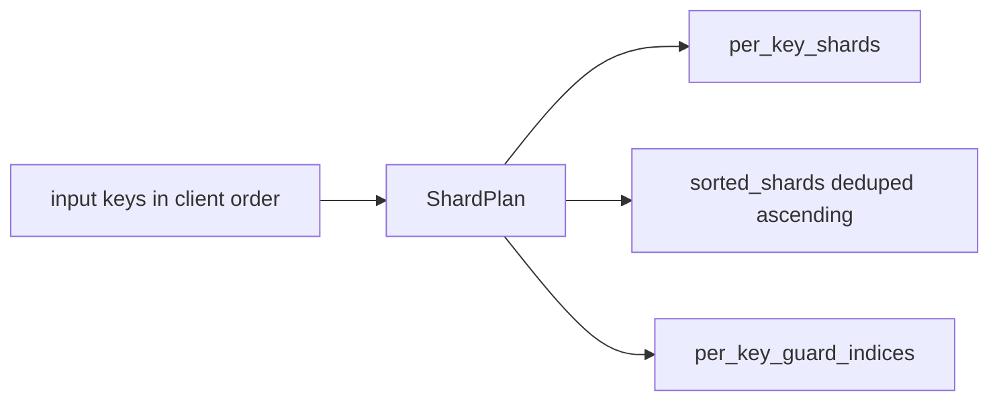
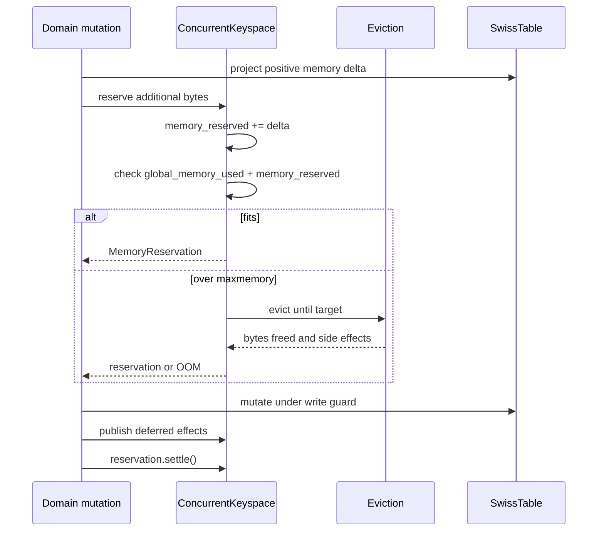

# ConcurrentKeyspace Deep Dive

`ConcurrentKeyspace` is the engine coordination layer. It makes thousands of independent `SwissTable` shards behave like one Redis-compatible database while keeping the normal command path local and predictable.

It owns:

- shard routing and lock acquisition
- TTL counters and active-expiry entry points
- memory accounting, maxmemory admission, and eviction
- WATCH versions and absent-key watch tracking
- global LSN allocation for WATCH and AOF
- per-shard transaction visibility gates
- runtime metrics and memory attribution

It does not parse RESP, own connection state, or write persistence files.

## Shape


```mermaid
flowchart TD
    KS[ConcurrentKeyspace]
    KS --> Shards["shards: Box CachePadded RwLock SwissTable"]
    KS --> Clock["clock_hands: per-shard eviction cursor"]
    KS --> Expiry["expiry_key_count + expiry_key_total"]
    KS --> Route["mask + fixed-seed shard hasher"]
    KS --> TableHash["table_hasher shared by all shard tables"]
    KS --> Memory["global_memory_used + memory_reserved"]
    KS --> Features["mutation_features bits"]
    KS --> LSN["global_lsn + aof_recording_refs"]
    KS --> Eviction["EvictionConfigState + FrequencySketch"]
    KS --> Watch["absent_watch_shards + watch_active + watch_epoch"]
    KS --> Gates["transaction_gates per shard"]
    KS --> Metrics["runtime_metrics + eviction_metrics"]
```

The shard array is the main state owner:

```rust
type Shard = CachePadded<RwLock<SwissTable>>;
```

`CachePadded` keeps adjacent shard locks from sharing cache lines. The `RwLock` is from `parking_lot`, and each shard table is independent from every other shard table.

## Shard Count Invariants

Shard count is represented by `ShardCount`.

The allowed range is:

```text
MIN_SHARD_COUNT = 64
DEFAULT_SHARD_COUNT = 4096
MAX_SHARD_COUNT = 131072
```

The count must be a power of two. That rule allows shard routing to use a bitwise AND instead of division:

```text
shard_index = hash(key) & (num_shards - 1)
```

For a power-of-two shard count, `num_shards - 1` is a mask with the low bits set. If there are 4096 shards, the mask is `0xfff`. `hash & 0xfff` keeps only the low 12 bits, which is equivalent to `hash % 4096` but cheaper.

## Two Hashers

The keyspace keeps two hashers because it has two different jobs.

| Hasher | Seeds | Used for | Why |
| --- | --- | --- | --- |
| `hasher` | Fixed seeds | Shard routing | Stable routing across process restarts and benchmark runs. |
| `table_hasher` | Random per keyspace | Slot placement inside each SwissTable | Lets batch commands pre-hash before taking shard locks while keeping the table hash policy shared across shards. |

This means "which shard?" and "which control group inside the table?" are separate contracts.

## Locking Model

Single-key commands route to one shard and acquire one read or write lock.

Multi-key commands first build a shard plan:


```mermaid
flowchart LR
    Keys["input keys in client order"] --> Plan[ShardPlan]
    Plan --> PerKey["per_key_shards"]
    Plan --> Sorted["sorted_shards deduped ascending"]
    Plan --> Guards["per_key_guard_indices"]
```

The keyspace then locks `sorted_shards` in ascending order. That deterministic order prevents deadlocks because all threads wait for shard locks in the same sequence.

Example:

```text
keys arrive in order:     k0 -> shard 25, k1 -> shard 10, k2 -> shard 25, k3 -> shard 90
sorted unique lock order: shard 10, shard 25, shard 90
guard mapping:            k0 -> guard 1, k1 -> guard 0, k2 -> guard 1, k3 -> guard 2
```

The engine uses two plan types:

- `ShardPlan`: plans from raw key byte slices.
- `PrehashedShardPlan`: stores each key index, key bytes, shard id, table hash, and guard index. Batch paths use this to avoid repeated hashing and binary searches.

## Read Guards And Write Guards

Read guards are direct `RwLockReadGuard` values in normal builds.

Write guards are wrapped by `ShardWriteGuard`. On drop, a write guard flushes table-local memory drift to the shared memory counter:

```text
table mutation
  -> SwissTable.memory_used changes exactly
  -> SwissTable.memory_drift accumulates signed delta
  -> ShardWriteGuard drops
  -> flush_memory_drift_with(global_memory_used, strict_memory_accounting)
```

This avoids one shared atomic update per mutation. In normal mode, drift flushes once it crosses `MEMORY_ACCOUNTING_FLUSH_THRESHOLD` or when forced. With maxmemory active, `strict_memory_accounting` forces publication on each write guard drop so admission and eviction see current pressure.

## Mutation Features

Hot mutation code checks one feature word instead of repeatedly loading unrelated atomics.

`MutationFeatures` currently has:

| Bit | Meaning |
| --- | --- |
| `MAXMEMORY` | Mutations may need memory reservation and eviction. |
| `WATCH` | Mutations must publish WATCH invalidations and entry-visible versions. |
| `AOF` | Mutations must allocate AOF-visible LSNs and may create AOF side records. |

The WATCH bit is derived from `watch_active`, so the write path stays cold when no client is using WATCH.

## Memory Admission

Maxmemory admission is reservation based. It prevents concurrent writers from all passing against the same stale memory value.


```mermaid
sequenceDiagram
    participant Cmd as Domain mutation
    participant KS as ConcurrentKeyspace
    participant Ev as Eviction
    participant Table as SwissTable

    Cmd->>Table: project positive memory delta
    Cmd->>KS: reserve additional bytes
    KS->>KS: memory_reserved += delta
    KS->>KS: check global_memory_used + memory_reserved
    alt fits
        KS-->>Cmd: MemoryReservation
    else over maxmemory
        KS->>Ev: evict until target
        Ev-->>KS: bytes freed and side effects
        KS-->>Cmd: reservation or OOM
    end
    Cmd->>Table: mutate under write guard
    Cmd->>KS: publish deferred effects
    Cmd->>KS: reservation.settle()
```

`MemoryReservation` is an RAII token. If an error path returns early, dropping the token releases the reservation. After a successful mutation, `settle()` releases the reserved bytes once table memory drift has been published.

When admission requires revalidation, `ReservationCoordinator` follows this loop:

1. Project delta before locking or from a read guard.
2. Reserve that projected positive delta.
3. Acquire the write lock.
4. Recompute the required delta against the current table state.
5. If the reservation is too small, drop the lock, reserve the extra bytes, and retry.
6. Mutate only after the reservation covers the actual required delta.

That loop is why maxmemory correctness does not depend on an optimistic stale projection.

## TTL State

TTL state is entry-resident. `Entry::ttl_deadline()` returns an absolute monotonic nanosecond deadline, and `0` means persistent.

The keyspace tracks TTL counts separately:

- `expiry_key_count[shard]`: approximate count of TTL-bearing keys in one shard.
- `expiry_key_total`: approximate total TTL-bearing keys.

Domain mutations do not directly edit those counters. They build an `ExpiryTransition`:

```text
had_ttl before mutation -> has_ttl after mutation
```

After shard guards drop, the domain publishes the transition and the keyspace updates the counters.

### Lazy Expiry

Reads treat expired entries as missing. Common flow:

```text
read lock
  -> lookup value and ttl
  -> if ttl is live, return value
  -> if ttl is expired:
       drop read lock
       take write lock
       re-check via slot cursor
       delete if still expired
       publish TTL and WATCH effects
       return missing/nil
```

This keeps the common read-hit path on a read lock and moves cleanup to a write lock only when necessary.

### Active Expiry

Reactors can call `run_active_expiry_on_shard(shard, start_slot, max_effort, now_nanos)`. It:

1. Skips the shard if the TTL count says no TTL-bearing keys exist.
2. Takes one shard write lock.
3. Scans up to `max_effort` slots from `start_slot`.
4. Deletes expired slots by slot index.
5. Updates TTL counters and WATCH state.

The operation is bounded and allocation-free for ordinary slot deletion.

## LSNs

LSN means logical sequence number.

There are three wrapper types:

| Type | Meaning |
| --- | --- |
| `Lsn` | Generic raw logical sequence number wrapper. |
| `EntryLsn` | Entry-storable LSN. It must fit in 48 bits because `Entry` stores six bytes. |
| `AofLsn` | AOF-visible LSN used by persistence coordination. It shares the same 48-bit bound. |

`global_lsn` is an `AtomicU64`. `next_lsn()` increments it with relaxed ordering. That is enough because callers allocate LSNs while holding the shard write lock that orders same-key mutations.

Important details:

- Featureless writes can skip LSN allocation.
- WATCH-visible mutations allocate entry LSNs so present-key WATCH validation can compare versions.
- AOF recording allocates an `AofLsn` so the reactor can append the command in engine mutation order.
- `next_watch_visible_lsn()` skips `0`; `0` is the initial entry version and also used by absent WATCH state.
- Replay restoration can advance `global_lsn` to `max_replayed_lsn + 1`, but only during single-threaded startup or a quiesced state.

## WATCH State

WATCH is connection-scoped, but the keyspace owns the data needed to validate watched keys.

Present-key WATCH:

1. `watch_key` reads the key's current entry LSN.
2. The connection stores `WatchRegistration`.
3. Mutations to that key stamp a new entry LSN when WATCH is active.
4. `watched_keys_changed` compares the current entry LSN with the stored version.

Absent-key WATCH:

1. There is no entry LSN to read, so the keyspace registers the key in `absent_watch_shards`.
2. Mutations that create or touch that key bump the absent-watch version.
3. Validation checks that the key is still absent and that its absent-watch version did not change.

Whole-keyspace mutations such as FLUSH use `watch_epoch` to invalidate all watches.

The hot path avoids absent-key locks unless `absent_watch_active != 0`.

## Transaction Gates

`TransactionGate` is a small per-shard reader/writer gate:

```text
normal command touching shard S -> enters gate S as reader
EXEC touching shard S          -> enters gate S as writer
```

The reactor owns `MULTI`, queued commands, dirty transaction state, and WATCH lists. Before `EXEC` validates WATCH and drains queued commands, it enters the transaction gates for the sorted shard set that the transaction can touch.

This removes the old global transaction gate from normal commands. A normal single-key GET or SET only pays the gate for its touched shard when the reactor asks for scoped execution.

## Eviction Ownership

The keyspace owns eviction because eviction crosses several concerns:

- current maxmemory and policy
- memory pressure and reservations
- per-shard sweep cursors
- TTL filtering for volatile policies
- WATCH invalidation for evicted keys
- AOF side records for evicted keys
- runtime eviction metrics

Eviction has two entry points:

- Admission-time eviction from `ensure_memory_for_snapshot`.
- Maintenance-time eviction from `run_eviction_maintenance_on_shard`.

Both call the same bounded sweep driver over `SwissTable` slots.

## Metrics And Attribution

`ConcurrentKeyspace` exposes:

- `engine_memory_attribution()`: live keys, logical dataset bytes, table allocated bytes, slots, tombstones, load factor, bytes per live key, and shard count.
- `server_memory_attribution()`: IO-owned memory fields published by the reactor pool.
- `runtime_metrics()`: backend, reactor, AOF, overload, expiry, eviction, and profile-gated timing fields.
- `eviction_metrics()`: admissions, shards scanned, slots sampled, bytes freed, OOM-after-scan, and optional timing.

The key design is that high-frequency reactor counters use sharded slots. Profile timing fields are compiled only with `profile-telemetry`.

## Things To Avoid

Engine code should not:

- hold shard guards across reactor yield points
- allocate AOF files or call fsync
- parse connection-level transaction state
- bypass `engine::domain` for command-visible mutations
- update TTL counters without an `ExpiryTransition`
- stamp entry LSNs for featureless writes unless a feature consumes them
- add shared hot atomics without benchmark and profiler evidence
