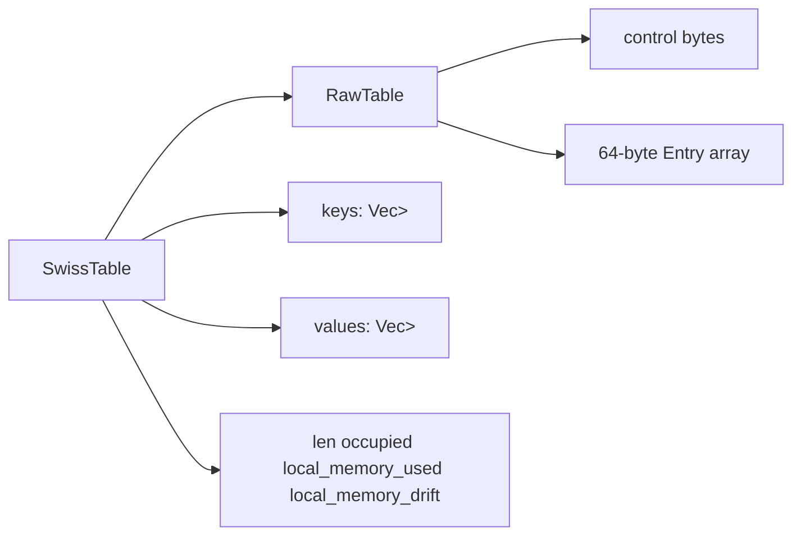

# SwissTable Deep Dive

Inside each shard, Vortex stores keys in a custom open-addressing hash table implemented in [src/table.rs](../src/table.rs). The design borrows the core SwissTable idea: keep a compact control-byte array separate from the payload array, probe in groups of 16 slots, and use SIMD to reject most non-matches before touching the full entry.

That last point matters because the real hot path is not "hash -> chase pointer -> compare key". The hot path is:

1. hash the key once with `ahash`
2. compute a small fingerprint called `H2`
3. scan 16 control bytes at a time using SIMD
4. only touch full entries for the few candidate slots whose control byte matches

The result is a table optimized around cache locality, predictable probing, and low branch pressure.

## What The Table Actually Owns

The most important correction to the original draft is this: the 64-byte `Entry` is not the entire data store by itself. The table is split across four cooperating regions.



- `RawTable` holds the manually allocated contiguous memory block for the control-byte array and the `Entry` array.
- `keys` is the ownership store for `VortexKey` values.
- `values` is the ownership store for `VortexValue` values.
- Each `Entry` stores compact metadata, inline small payloads when possible, and borrowed pointers into the owning `keys` and `values` vectors when the payload spills.

This split is deliberate. It lets the probe path touch only the tiny control-byte region first, while still allowing the API to return borrowed `&VortexValue` references from stable owned storage.

## High-Level Memory Layout

`RawTable` allocates a single contiguous block with this shape:

```text
[ ctrl bytes: (num_groups + 1) * 16 ] [ pad to 64-byte alignment ] [ Entry array ]
```

- `GROUP_SIZE` is always 16.
- Each group has 16 control bytes and 16 corresponding entries.
- The extra `+1` control group is a sentinel mirror of group 0.
- Entries are 64-byte aligned and exactly 64 bytes wide.

The sentinel mirror exists so a 16-byte SIMD load at the logical end of the control-byte array is still safe. When slot `0..15` changes, `RawTable::set_ctrl` also writes the mirrored byte into the extra control group.

## Probe Groups And Control Bytes

The table does not probe entries one-by-one first. It probes *groups*.

- 1 group = 16 slots
- 1 group = 16 control bytes
- 1 control group fits exactly in one SSE2 or NEON register

Control bytes encode the slot state:

```text
EMPTY   = 0xFF   // never used
DELETED = 0x80   // tombstone
H2      = control-byte-safe fingerprint for occupied slots
```

Two properties matter here:

1. `EMPTY` ends a search. If a probe sequence reaches an empty slot, the key is definitely not in the table.
2. `DELETED` does not end a search. A tombstone means "something used to be here, keep probing".

The table stores the same control byte twice:

- in the separate control-byte array used by `Group::match_h2`
- in `Entry.control` so the entry remains self-describing

The probe path uses the separate control array because it is denser and much cheaper to scan than loading full 64-byte entries.

## H1 And H2

Every key is hashed with `ahash::RandomState`.

```rust
let hash = self.hasher.hash_one(key_bytes);
```

That 64-bit hash is split into two logical parts:

- `H1`: the starting group index
- `H2`: the short fingerprint stored in each control byte

### H1: Starting Group

`H1` is simply the low bits of the hash:

```rust
const fn h1_from_hash(hash: u64) -> usize {
    hash as usize
}
```

`ProbeSeq::new` masks this with `num_groups - 1`.

```rust
pos = h1 & mask
```

Because the number of groups is always a power of two, that mask is a fast modulo operation.

### H2: Fingerprint Stored In Control Bytes

`H2` comes from the high bits of the hash and is encoded so it never collides with the sentinel bytes:

```rust
fn h2_from_hash(hash: u64) -> u8 {
    let raw = ((hash >> 57) as u8) | 0x81;
    if raw == CTRL_EMPTY { 0xFE } else { raw }
}
```

Breakdown of `((hash >> 57) as u8) | 0x81`:

1. `hash >> 57` keeps the top 7 bits of the 64-bit hash.
2. `as u8` moves that small value into a single byte.
3. `| 0x81` forces the high bit on and keeps the result in the occupied-slot encoding space rather than the sentinel space.
4. If the encoded byte still lands on `0xFF`, the code remaps it to `0xFE` so `0xFF` remains reserved for `EMPTY`.

The exact goal is not "use every byte value densely". The goal is "derive a short fingerprint that is legal for occupied slots and easy to compare in bulk".

`H2` is only a prefilter. A matching control byte does **not** prove key equality. It only means "this slot is worth checking".

## BitMask: Compact Match Results

`Group::match_h2` returns a `BitMask(u16)`.

One bit corresponds to one slot in the 16-slot group:

```text
bit 0  -> slot 0
bit 1  -> slot 1
...
bit 15 -> slot 15
```

If bits 1, 5, and 9 are set, the mask means "candidate matches exist at group-local slots 1, 5, and 9".

The helper methods are small but important:

- `any_set()` answers "did anything match?"
- `lowest()` uses `trailing_zeros()` to find the first candidate slot cheaply
- the iterator implementation repeatedly clears the lowest set bit with `self.0 &= self.0 - 1`

That last trick is a classic bit-twiddling operation:

```text
mask         = 0010_1000
mask - 1     = 0010_0111
mask&(mask-1)= 0010_0000
```

It removes the lowest set bit without looping over all 16 positions.

## Group: SIMD Probe Of 16 Control Bytes

`Group` is the abstraction that probes one control group.

### x86_64 Path

On x86_64, the code uses SSE2:

1. `_mm_loadu_si128` loads 16 control bytes.
2. `_mm_set1_epi8` broadcasts the `H2` byte across all 16 lanes.
3. `_mm_cmpeq_epi8` compares all lanes in parallel.
4. `_mm_movemask_epi8` converts lane equality into a 16-bit bitmask.

### aarch64 Path

On aarch64, the code uses portable SIMD with a 16-lane `Simd<u8, 16>` and `simd_eq().to_bitmask()`.

### Scalar Fallback

If the `simd` feature is disabled or no supported SIMD target is active, the code falls back to a scalar loop over the 16 bytes.

### `match_empty` And `match_empty_or_deleted`

- `match_empty(ctrl)` finds search terminators.
- `match_empty_or_deleted(ctrl)` finds insert candidates.

Insertion cannot use an empty-only probe because tombstones are reusable. The implementation simply ORs the `EMPTY` and `DELETED` masks.

## ProbeSeq: Triangular Probing

The table uses triangular probing rather than linear probing.

```text
start at group g
then probe g + 1
then g + 1 + 2
then g + 1 + 2 + 3
...
```

In code:

```rust
self.stride += 1;
self.pos = (self.pos + self.stride) & self.mask;
```

Why this shape:

- it spreads collisions across the table better than naive linear probing
- it keeps the operation branch-light
- with a power-of-two group count, the sequence visits every group before repeating

For example, with 8 groups and start position 0, the probe order is:

```text
0 -> 1 -> 3 -> 6 -> 2 -> 7 -> 5 -> 4
```

That covers all 8 groups exactly once before cycling.

## RawTable: Manual Allocation For The Hot Arrays

`RawTable` is the low-level allocator and pointer wrapper.

Responsibilities:

- allocate one aligned block for control bytes plus entries
- initialize every control byte to `CTRL_EMPTY`
- initialize every `Entry` to `Entry::empty()`
- expose pointer-level helpers like `ctrl_group`, `ctrl_at`, `entry`, and `entry_mut`
- maintain the mirrored sentinel group
- free the block in `dealloc`

This layer is intentionally small. It owns raw memory and pointer arithmetic. It does **not** implement hashing policy, key comparison policy, TTL policy, or growth policy. Those live one level up in `SwissTable`.

## The 64-Byte Entry

Each slot has a 64-byte `Entry` defined in [src/entry.rs](../src/entry.rs).

```rust
#[repr(C, align(64))]
pub struct Entry {
    pub control: u8,
    pub key_len: u8,
    pub flags: AtomicU16,
    pub _pad0: u32,
    pub ttl_deadline: u64,
    pub key_data: [u8; 23],
    pub value_tag: u8,
    pub value_data: [u8; 21],
    pub _pad1: [u8; 3],
}
```

Field-by-field meaning:

- `control`: the slot fingerprint or sentinel
- `key_len`: inline key length when the key is stored inline
- `flags`: inline/heap markers, integer marker, TTL marker, a 4-bit Morris eviction counter, and the value-type nibble
- `_pad0`: currently reused for `AccessProfile` without increasing entry size
- `ttl_deadline`: absolute expiration time in nanoseconds, `0` means no TTL
- `key_data`: inline key bytes or heap-key metadata
- `value_tag`: inline length or special tag (`HEAP_VALUE_TAG` / `INTEGER_VALUE_TAG`)
- `value_data`: inline bytes, integer bytes, or a pointer to the owning `VortexValue`

The high-level bit layout of `flags` matters because eviction piggybacks on it:

- low bits: inline / integer / TTL markers
- bits 4-7: Morris counter used by clock-sweep second chances
- bits 12-15: value-type nibble

That reuse is deliberate. The entry stays one cache line wide, and eviction metadata never turns into a second pointer-chasing structure.

### Inline Fast Path

For small string workloads, the entry can carry almost everything inline:

- key inline if `key.len() <= 23`
- string value inline if `value.len() <= 21`
- integer inline in `value_data[..8]`

Example:

```text
SET my_token short_data
```

- `my_token` fits in `key_data`
- `short_data` fits in `value_data`
- TTL is in the same cache line
- lookup avoids a second hop into heap-owned payload for the string bytes

### Heap-Spill Encoding

When the key or value is too large to fit inline, the entry switches to a borrowed-metadata form:

- long keys store `ptr + len` in `key_data`
- heap-backed values store a pointer to the owned `VortexValue` in `value_data`
- complex container types (`List`, `Hash`, `Set`, `SortedSet`, `Stream`) always use the heap-backed path

This is where the separate `keys` and `values` vectors matter. The `Entry` does not own those heap values. It borrows them. `SwissTable` owns them and rewrites the entry metadata on overwrite or resize so the borrowed pointers stay valid.

## SwissTable Structure

At the top level, `SwissTable` contains:

- `raw: RawTable`
- `hasher: RandomState`
- `keys: Vec<Option<VortexKey>>`
- `values: Vec<Option<VortexValue>>`
- `len`: live entry count
- `occupied`: live entries + tombstones
- `local_memory_used`: exact local memory usage for live entries
- `local_memory_drift`: signed delta not yet flushed to the global counter

Two counters are easy to confuse:

- `len` tracks only live entries
- `occupied` tracks live entries **plus tombstones**

Growth decisions use `occupied`, not `len`, because too many tombstones degrade probe quality even if many entries were deleted.

## How Lookup Works

`get()` is a thin wrapper around `find_slot()`.

```mermaid
flowchart TD
    A[hash key] --> B[compute H1 and H2]
    B --> C[load control group]
    C --> D[SIMD compare all 16 control bytes with H2]
    D --> E{any candidate bits set?}
    E -- yes --> F[check full key equality for each candidate slot]
    F --> G{key matched?}
    G -- yes --> H[return values[slot]]
    G -- no --> I[check EMPTY mask]
    E -- no --> I
    I -- empty present --> J[stop: key absent]
    I -- no empty --> K[advance triangular probe]
    K --> C
```

Detailed steps:

1. Hash the key bytes.
2. Compute `H2` for control-byte filtering.
3. Compute starting group from `H1`.
4. Probe one group at a time.
5. For each matching `H2` bit, load the full `Entry` and run `entry.matches_key(key_bytes)`.
6. If any `EMPTY` control byte exists in the group and no candidate matched, stop immediately: the key does not exist.
7. Otherwise advance the triangular probe sequence and repeat.

The key insight is that most misses never touch most full entries. They die in the control-byte stage.

## How Insertion Works

`insert()` is a two-phase operation.

### Phase 1: Check Whether The Key Already Exists

Before inserting, the table probes with `find_slot()`.

If the key exists:

- calculate the old memory usage
- preserve the old TTL for plain `insert()`
- replace the owned key/value in `keys[slot]` and `values[slot]`
- rewrite the 64-byte `Entry` via `write_entry`
- update the control byte to the new `H2`
- record the memory delta

### Phase 2: Find The First Reusable Slot

If the key is absent, the table probes again with `find_insert_slot()`.

That path stops at the first slot marked `EMPTY` or `DELETED`.

Then it:

1. stores the owned `VortexKey` and `VortexValue`
2. writes the compact entry metadata
3. writes the control byte
4. increments `len`
5. increments `occupied` only if the slot was truly `EMPTY`
6. records the new memory usage

Reusing a tombstone increases `len` but does **not** increase `occupied`, because the slot was already counted as non-empty.

## How Removal Works

Removal uses `delete_slot()` after locating the slot.

`delete_slot()` does three things:

1. marks the entry as deleted with `entry.mark_deleted()`
2. updates the control-byte array to `CTRL_DELETED`
3. clears the owned key and takes the owned value out of `values[slot]`

Then it:

- decrements `len`
- subtracts the slot's memory usage from `local_memory_used`
- leaves `occupied` unchanged

That last point is critical. A tombstone is still an occupied probe location, so the table cannot pretend the slot became empty.

## Resize Strategy

The table resizes when:

```text
occupied >= capacity * 7 / 8
```

That `7/8` load factor is standard SwissTable territory: aggressive enough to use memory well, conservative enough to keep probes short.

Resize steps:

1. double the number of groups
2. allocate a fresh `RawTable`
3. allocate fresh `keys` and `values` vectors
4. walk the old table and skip `EMPTY` / `DELETED` slots
5. rehash each live key into the new table
6. move ownership into the new `keys` / `values` vectors
7. rewrite each new `Entry`
8. free the old raw allocation
9. set `occupied = len`

Rewriting the entries is necessary because some entries store borrowed pointers into the owning vectors. A resize moves ownership to new vector slots, so the metadata must be rebuilt rather than copied byte-for-byte.

## Memory Accounting: `local_memory_used`, `local_memory_drift`, `flush_memory_drift`

The table carries two different memory views.

### `local_memory_used`

This is the exact shard-local memory usage for *live* entries. The helper is:

```rust
size_of::<Entry>() + key.memory_usage() + value.memory_usage()
```

Each insert, overwrite, or remove updates that number immediately.

### `local_memory_drift`

This is a signed accumulator of unflushed memory deltas.

- insertions push it positive
- removals push it negative
- overwrites add the difference between new and old payload size

Why keep both values:

- `local_memory_used` stays exact for the shard
- `local_memory_drift` batches updates to the global atomic counter so the hot path does not pay an atomic operation for every mutation

### `flush_memory_drift`

`flush_memory_drift(&AtomicUsize)` publishes buffered drift to the shared counter only when the absolute value exceeds `16 * 1024` bytes.

Behavior:

- positive drift uses `fetch_add(Ordering::Relaxed)`
- negative drift uses `fetch_update` with `saturating_sub` so the global count never underflows
- after publishing, `local_memory_drift` resets to `0`

This is a classic fast-path tradeoff:

- local numbers stay exact
- the global number is slightly delayed
- atomic contention drops substantially on write-heavy paths

## TTL And Expiry Behavior

TTL is integrated directly into the entry layout and the table API.

### Per-Entry TTL Storage

Each entry stores `ttl_deadline: u64` in absolute nanoseconds.

- `0` means no TTL
- non-zero means expire at or after that timestamp

### TTL-Specific Table Operations

The table exposes a dedicated TTL API:

- `insert_with_ttl`
- `get_with_ttl`
- `get_with_ttl_mut`
- `get_with_ttl_prehashed`
- `remove_with_ttl`
- `set_entry_ttl`
- `clear_entry_ttl`
- `get_entry_ttl`

### Lazy Expiry

`get_or_expire` and `contains_key_or_expire` perform lazy expiry:

1. find the slot
2. check `entry.is_expired(now_nanos)`
3. if expired, tombstone it in place with `delete_slot`
4. return miss / false

That keeps the common read path cheap while still cleaning up stale keys as they are touched.

### Active Expiry Safety

The active expiry path uses `remove_expired_by_hash(hash, deadline_nanos)`.

It does **not** remove a slot solely because `H2` and the deadline match. It also verifies the full key hash before deleting the entry. That matters because `H2` is only a short fingerprint and collisions are expected.

In other words:

- `H2` narrows the search
- full hash verification makes the delete correct

## `ctrl_group`, `ctrl_at`, And Why They Exist

The raw helper methods are worth calling out because they shape the entire design.

- `ctrl_group(group_idx)` returns a pointer to the first of 16 control bytes for one probe group
- `ctrl_at(slot)` returns the control byte for one absolute slot
- `entry(slot)` and `entry_mut(slot)` return the `Entry` payload for one absolute slot

This split lets the table do two different things efficiently:

- bulk group-level filtering through `ctrl_group`
- precise single-slot mutation through `ctrl_at` and `entry_mut`

Without that separation, every probe would have to touch 64-byte entries far too early.

## Prefetch Support

The table also exposes:

- `prefetch_group(hash)`
- `prefetch_group_write(hash)`

These compute the starting group from `H1` and prefetch:

- the 16-byte control group
- the first entry in the group

This is used by some batch command paths to overlap memory latency with earlier work, although software prefetch is workload-dependent and is not universally beneficial.

## Why This Design Fits Vortex

This implementation is tuned for Vortex's actual workload profile:

- many tiny keys
- many tiny string or integer values
- frequent point lookups
- predictable shard-local access under `RwLock`
- strict interest in memory traffic, not just algorithmic big-O

The combination of group probing, 64-byte entries, inline small payloads, tombstone reuse, and batched global memory accounting is what makes the table fast in practice, not any single trick alone.

## Summary

The Vortex SwissTable is a hybrid of four ideas working together:

1. a SIMD-scannable control-byte array for cheap candidate filtering
2. a 64-byte entry format for cache-line-local metadata and inline payloads
3. external ownership vectors for full `VortexKey` / `VortexValue` storage and stable borrowing
4. shard-local memory and TTL bookkeeping integrated directly into the table API

That is why the table can support fast `GET`, `SET`, TTL operations, memory accounting, and future structure-specific optimizations without turning the hot path into a pointer-heavy maze.

Next documents in this series:

- [01-architecture-overview.md](01-architecture-overview.md)
- [02-concurrent-keyspace.md](02-concurrent-keyspace.md)
- [04-command-execution.md](04-command-execution.md)
