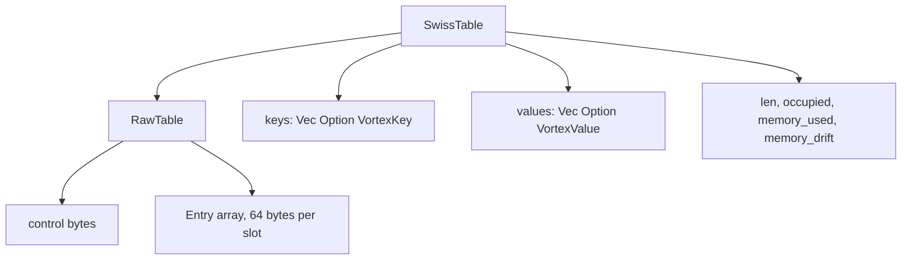
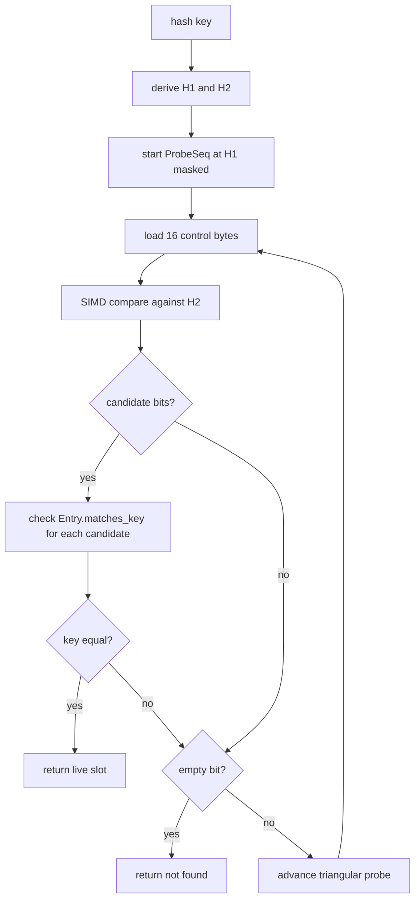

# SwissTable And Entry Layout

`SwissTable` is the per-shard storage engine in `vortex-engine`. It is an open-addressing hash table inspired by SwissTable-style designs: keep compact control bytes separate from payload storage, probe 16 slots at a time, and touch full entries only for likely matches.

This document explains the current implementation in `src/table.rs` and `src/entry.rs`.

## What "Swiss Table" Means

A normal hash table often does this:

```text
hash key -> choose bucket -> follow pointer -> compare full key
```

SwissTable-style probing changes the first part:

```text
hash key
  -> split hash into H1 and H2
  -> use H1 to choose a group of 16 slots
  -> SIMD-compare 16 one-byte H2 fingerprints
  -> only inspect full entries for matching control bytes
```

The control bytes are dense and cache-friendly. Most failed lookups never touch the 64-byte `Entry` or the owned key/value arrays.

## Table Ownership

`SwissTable` owns four kinds of state:


```mermaid
flowchart TD
    T[SwissTable]
    T --> Raw[RawTable]
    T --> Keys["keys: Vec Option VortexKey"]
    T --> Values["values: Vec Option VortexValue"]
    T --> Counters["len, occupied, memory_used, memory_drift"]
    Raw --> Ctrl["control bytes"]
    Raw --> Entries["Entry array, 64 bytes per slot"]
```

`Entry` is slot metadata and a compact payload view. It is not the only key/value owner:

- `keys[slot]` owns the `VortexKey`.
- `values[slot]` owns the `VortexValue`.
- `Entry` stores inline copies for small bytes when possible and borrowed pointer metadata for heap-backed owners.

That split is why `Entry::write_borrowed` is unsafe and crate-private to the table: the table must guarantee that the owned key/value outlive the entry view and that entries are rewritten when owners move during resize.

## RawTable Allocation

`RawTable` allocates one aligned block:

```text
raw allocation
  [ control bytes: (num_groups + 1) * 16 ]
  [ padding up to 64-byte alignment ]
  [ Entry array: num_groups * 16 * 64 bytes ]
```

The extra control group is a sentinel mirror of group 0. It allows unaligned 16-byte SIMD loads near the logical end of the control array without reading outside the allocation.

Current code initializes:

- all control bytes to `CTRL_EMPTY`
- every entry slot to `Entry::empty()`
- `keys` and `values` to `vec![None; num_slots]`

This means an empty pre-sized table reserves and touches table-owned slot storage. `allocated_bytes()` reports the table-owned footprint for control bytes, entries, and key/value slot arrays. `memory_used()` reports logical live dataset usage.

## Groups And Slots

One group has 16 slots:

```text
group 0: slots  0..15
group 1: slots 16..31
group 2: slots 32..47
...
```

The matching control bytes are stored contiguously:

```text
control group 0: ctrl[0..15]
control group 1: ctrl[16..31]
control group 2: ctrl[32..47]
...
sentinel group: mirror of ctrl[0..15]
```

`SlotIndex` and `GroupIndex` are small newtypes used inside the table so code does not pass unchecked `usize` values through the low-level paths.

## Control Bytes

Every slot has one control byte.

```text
0xff = CTRL_EMPTY    never used
0x80 = CTRL_DELETED  tombstone
other high-bit-set values = occupied H2 fingerprint
```

Rules:

- `EMPTY` terminates lookup. If the probe chain reaches an empty slot, the key was never inserted along that chain.
- `DELETED` does not terminate lookup. It means "a key used to be here, keep probing."
- `DELETED` can be reused for insertion.
- Occupied slots store an H2 fingerprint in both the control array and `Entry.control`.

## H1 And H2

The table hashes key bytes with `ahash::RandomState` and splits the 64-bit hash.

### H1

`H1` is used to pick the starting group:

```rust
const fn h1_from_hash(hash: u64) -> usize {
    hash as usize
}
```

The group index is:

```text
start_group = H1 & (num_groups - 1)
```

The `&` operation works as fast modulo because `num_groups` is always a power of two.

### H2

`H2` is a one-byte fingerprint:

```rust
let raw = ((hash >> 57) as u8) | 0x80;
match raw {
    CTRL_DELETED => 0x81,
    CTRL_EMPTY => 0xFE,
    _ => raw,
}
```

Step by step:

1. `hash >> 57` keeps the top 7 bits of the hash.
2. `as u8` narrows those bits to one byte.
3. `| 0x80` forces the high bit on, putting the byte in the occupied-control-byte range.
4. `0x80` and `0xff` are remapped because they are reserved for `DELETED` and `EMPTY`.

H2 is only a prefilter. A matching H2 means "check this full key." It does not prove equality.

## BitMask

`Group::match_h2` returns `BitMask(u16)`: one bit for each slot in the group.

```text
bit 0  -> group-local slot 0
bit 1  -> group-local slot 1
...
bit 15 -> group-local slot 15
```

If the mask is:

```text
0000_0000_0010_1000
```

then group-local slots 3 and 5 matched.

The iterator removes the lowest set bit with:

```rust
self.0 &= self.0 - 1;
```

Why this works:

```text
mask          0010_1000
mask - 1      0010_0111
mask & mask-1 0010_0000
```

Subtracting one flips the lowest set bit and all lower bits. ANDing clears only that lowest set bit.

## SIMD Group Matching

On x86_64 with the `simd` feature:

1. `_mm_loadu_si128` loads 16 control bytes.
2. `_mm_set1_epi8` copies H2 into all 16 SIMD lanes.
3. `_mm_cmpeq_epi8` compares all 16 lanes at once.
4. `_mm_movemask_epi8` converts equality lanes into a 16-bit mask.

On aarch64 with the `simd` feature, the code uses `Simd<u8, 16>` and `simd_eq().to_bitmask()`.

Without those paths, scalar matching loops over 16 bytes. Correctness is the same; only the cost changes.

## Triangular Probing

The probe sequence is triangular:

```text
pos = start
stride = 0

next:
  stride += 1
  pos = (pos + stride) & mask
```

For 8 groups starting at 0:

```text
0 -> 1 -> 3 -> 6 -> 2 -> 7 -> 5 -> 4
```

This visits every group before repeating when the group count is a power of two. It spreads collisions better than simple linear probing while staying branch-light.

## Lookup


```mermaid
flowchart TD
    A[hash key] --> B[derive H1 and H2]
    B --> C[start ProbeSeq at H1 masked]
    C --> D[load 16 control bytes]
    D --> E[SIMD compare against H2]
    E --> F{candidate bits?}
    F -- yes --> G[check Entry.matches_key for each candidate]
    G --> H{key equal?}
    H -- yes --> I[return live slot]
    H -- no --> J{empty bit?}
    F -- no --> J
    J -- yes --> K[return not found]
    J -- no --> L[advance triangular probe]
    L --> D
```

`Entry.matches_key` reads inline key bytes or borrowed heap-key metadata and then compares full bytes.

## Insert And Tombstone Reuse

Insertion first ensures the table is below the growth limit. The growth limit is 7/8 of slots.

Then it probes for an insert candidate:

- first `EMPTY` slot
- or first `DELETED` tombstone slot

If it uses an empty slot, `occupied` increases. If it uses a tombstone, `occupied` does not increase because the slot was already non-empty for probe-chain purposes. `len` increases for every new live key.

When `occupied >= capacity * 7 / 8`, resize doubles the number of groups and rehashes live entries. Tombstones disappear during resize.

## Slot Cursors

The table exposes crate-private cursor types for fused domain mutations:

| Cursor | Meaning |
| --- | --- |
| `LiveSlotCursor` | Key exists and has not expired at the supplied time. |
| `ExpiredSlot` | Key exists but its TTL has passed. |
| `VacantSlot` | Key is absent. |

The cursor owns the mutable table borrow. Domain code can inspect TTL/value state and mutate the observed slot without probing the same key again.

This is used by SET options, GETEX, PERSIST, EXPIRE, lazy expiry, and performance-sensitive string mutations.

## Entry Layout

Each table slot has exactly one 64-byte, 64-byte-aligned `Entry`.

```text
offset  size  field
------  ----  -------------------
0       1     control
1       1     key_len
2       1     flags
3       1     morris_cnt
4       4     access_profile
8       8     ttl_deadline_nanos
16      6     lsn_version
22      1     value_tag
23      1     _reserved
24      24    key_data
48      16    value_data
```

The static assertions in `entry.rs` enforce:

```rust
size_of::<Entry>() == 64
align_of::<Entry>() == 64
```

### Flags

`flags` uses low bits for representation and high bits for value type:

```text
bit 0     FLAG_INLINE_KEY
bit 1     FLAG_INLINE_VALUE
bit 2     FLAG_INTEGER_VALUE
bit 3     FLAG_HAS_TTL
bits 4-7  value type nibble
```

The value type nibble identifies logical value families such as integer, string, list, hash, set, zset, and stream.

### Inline And Heap Encoding

Keys up to `MAX_INLINE_KEY_LEN` bytes, currently 24, can be stored inline in `key_data`. Larger keys store pointer-plus-length metadata pointing at the slot-owned `VortexKey`.

String values up to `MAX_INLINE_VALUE_LEN` bytes, currently 16, can be stored inline in `value_data`. Integer values store their `i64` bytes in `value_data[..8]`. Heap-backed or complex values store a pointer to the slot-owned `VortexValue`.

The entry readers are safe because raw fields are private. External safe Rust cannot forge a heap pointer and then call `read_value`.

## TTL Deadline

`ttl_deadline_nanos` stores the monotonic deadline. `0` means no TTL.

The `FLAG_HAS_TTL` bit mirrors whether the deadline is non-zero. `Entry::is_expired(now_nanos)` checks both the flag and the deadline.

TTL state is stored in the entry so lookup can decide live-versus-expired without consulting a side map.

## LSN Version

`lsn_version` stores six bytes, or 48 bits. The maximum storable value is:

```text
(1 << 48) - 1
```

`Entry::set_lsn_version` panics if a larger value is supplied. The keyspace wrapper types keep AOF and entry LSNs inside this bound.

The entry version is used by WATCH and AOF-visible mutations. It is intentionally not updated for every featureless write because that would add a global atomic to the plain SET hot path without an observer.

## Morris Count

`morris_cnt` is an `AtomicU8` per entry. It is a probabilistic access counter:

- it saturates at 255
- access recording increments less often as the count rises
- eviction can decrement it to give recently accessed keys a second chance

Increment probability is controlled by a random mask:

```text
counter = 0       -> increment every sampled access
counter = 1       -> increment when random low 1 bit is zero
counter = 2       -> increment when random low 2 bits are zero
...
counter = 63      -> increment when random low 63 bits are zero
counter >= 64     -> increment only when random is exactly all zero bits
```

This gives a compact approximation of "hotness" without an exact write-heavy counter. Exact counters can become expensive because each read would update a shared cache line. The Morris counter trades precision for much lower metadata cost.

## AccessProfile

`access_profile` is an `AtomicU32` storing `morph::AccessProfile`.

It packs:

```text
bits 0-3    read intensity
bits 4-7    write intensity
bit 8       sequential hint
bits 9-11   size class
bits 12-15  encoding
bits 16-25  access counter for periodic checks
bits 26-31  reserved
```

The current engine tracks this metadata in entries. Most adaptive structure transitions are future work, but keeping the profile entry-resident avoids adding a side allocation later.

## Memory Accounting

`SwissTable::memory_used()` is logical live dataset memory:

```text
size_of::<Entry>() + key.memory_usage() + value.memory_usage()
```

for each live slot.

`SwissTable::allocated_bytes()` is table-owned allocation:

```text
raw control bytes
+ raw Entry array bytes
+ keys Vec slot capacity bytes
+ values Vec slot capacity bytes
```

These numbers answer different questions:

- `memory_used`: how much live logical data the engine thinks it stores.
- `allocated_bytes`: how much table capacity has been reserved for slots.

Both are needed for fair memory work. A table can have low logical bytes and high allocated bytes when it is mostly empty, over-provisioned, or tombstone-heavy.

## Prefetch

`prefetch_group(hash)` and `prefetch_group_write(hash)` compute the initial group for a hash and issue CPU prefetch hints for:

- the control group
- the first entry in that group

Prefetch is a hint only. It cannot affect correctness and should be used only where measurement shows the extra instruction helps, such as selected batch paths.

## Important Invariants

- The number of groups is a power of two.
- Control bytes are authoritative for slot liveness.
- The sentinel control group mirrors group 0.
- A `LiveSlot` must only be created from a non-empty, non-deleted control byte.
- Entry heap pointers are valid only because the table owns the corresponding key/value slot and rewrites entries after movement.
- Tombstones keep probe chains valid until resize.
- Resize preserves TTL, LSN, Morris count, and access profile for live entries.
- Table memory drift must be flushed through `ShardWriteGuard` before global accounting is trusted.
