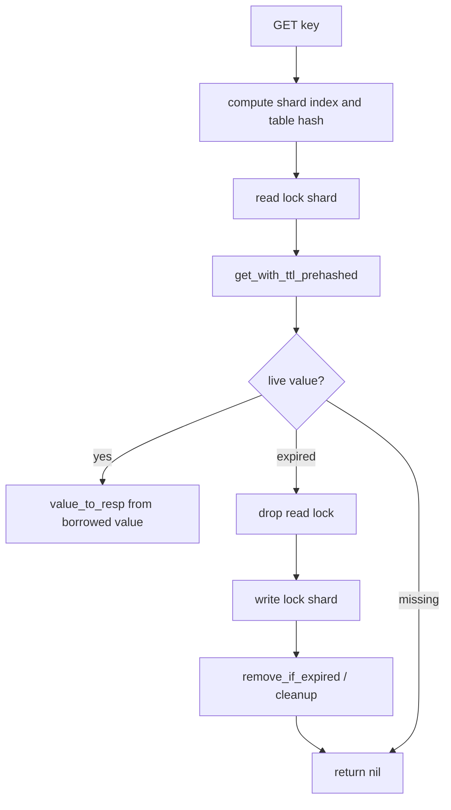

# Command Execution Deep Dive

The command layer in `vortex-engine` is intentionally simple at the top and highly specialized underneath. It does not use trait objects, dynamic registries, or per-command heap allocation to find a handler. Instead, it uses a static `match` on an already-normalized uppercase command name and then funnels the real work into keyspace helper methods.

That gives the crate three useful properties:

- dispatch is branchy but predictable and inlineable
- handlers can specialize hot paths aggressively
- locking and storage policy stay centralized in `ConcurrentKeyspace` and `SwissTable`

## Entry Point: `execute_command`

The engine's main dispatch function is:

```rust
pub fn execute_command(
    keyspace: &ConcurrentKeyspace,
    name: &[u8],
    frame: &FrameRef<'_>,
    now_nanos: u64,
) -> Option<ExecutedCommand>
```

Inputs:

- `keyspace`: the shared concurrent database
- `name`: uppercase ASCII command name
- `frame`: zero-copy RESP view from `vortex-proto`
- `now_nanos`: caller-supplied timestamp used for TTL logic

Output:

- `Some(ExecutedCommand)` if the engine knows the command
- `None` if the command is unknown to the engine dispatcher

The caller is expected to do command-name normalization before entering the engine. That keeps the engine focused on execution rather than command parsing policy.

## Command Module Layout

The command subsystem is split by responsibility.

- `commands/mod.rs`: static dispatch, shared result types, argument helpers
- `commands/context.rs`: methods on `ConcurrentKeyspace` that implement common lock-and-table patterns
- `commands/string.rs`: string commands such as `GET`, `SET`, `MGET`, `APPEND`, `INCR`
- `commands/key.rs`: key management and TTL commands such as `DEL`, `EXPIRE`, `TTL`, `RENAME`, `SCAN`
- `commands/server.rs`: server and connection-level commands such as `PING`, `DBSIZE`, `INFO`, `COMMAND`
- `commands/pattern.rs`: glob matching used by `KEYS` / `SCAN`

This split keeps parsing and response shaping in the leaf handler files while keeping common locking and mutation patterns in one place.

## Dispatch Model

The dispatcher is a compile-time `match` over byte strings.

That matters because it avoids:

- trait object calls
- hash-table-based handler lookup inside the engine
- command object allocation

The handler list is explicit and readable. More importantly, it lets the compiler inline short handlers and propagate constants such as `RESP_OK` and `RESP_NIL` deep into the call graph.

## Response Model: `CmdResult` And `ExecutedCommand`

The command layer separates the *payload* from the *mutation metadata*.

### `CmdResult`

`CmdResult` has three variants:

```rust
pub enum CmdResult {
    Static(&'static [u8]),
    Inline(InlineResp),
    Resp(RespFrame),
}
```

They correspond to three cost tiers.

#### `Static(&'static [u8])`

Used for precomputed wire bytes such as:

- `+OK\r\n`
- `$-1\r\n`
- `:0\r\n`
- common error responses

This is the cheapest path: no dynamic allocation and no per-call serialization work.

#### `Inline(InlineResp)`

Used for tiny dynamic responses that still fit in a fixed stack buffer.

Examples:

- small bulk strings
- integer replies formatted into a small inline buffer

`InlineResp` stores up to 32 bytes in-place, which covers many hot-path string and integer replies.

#### `Resp(RespFrame)`

Used when the response is structurally dynamic or larger than the inline path is designed for.

Examples:

- large bulk strings
- arrays such as `MGET` or `COMMAND`
- `INFO` output

So the engine is not "zero allocation everywhere". It is "avoid allocation where possible, allocate only where the response shape actually requires it".

### `ExecutedCommand`

`ExecutedCommand` wraps:

- `response: CmdResult`
- `aof_lsn: Option<u64>`

That optional LSN is the bridge from engine mutation semantics to persistence ordering. Read-only commands usually return `None`. Mutation commands may allocate an LSN and return it alongside the response.

## Argument Extraction Strategy

The engine uses a layered argument strategy rather than always collecting everything first.

### Fast Single-Argument Access

For hot commands with a tiny fixed argument count, handlers often use:

- `arg_bytes(frame, index)`
- `arg_count(frame)`
- `arg_i64(frame, index)`

That avoids building a temporary argument vector.

### `CommandArgs`

For commands with options or variable arity, handlers use `CommandArgs::collect(frame)`.

`CommandArgs` stores arguments in `SmallVec<[&[u8]; 8]>`, which keeps small command shapes on the stack and only spills to the heap for larger argument counts.

### Shared Parsing Helpers

`commands/mod.rs` also provides:

- `parse_i64(bytes)`
- `key_from_bytes(bytes)`
- `value_from_bytes(bytes)`
- `value_to_resp(&VortexValue)`
- `owned_value_to_resp(VortexValue)`

These helpers encode engine policy, not just syntax:

- integer-looking byte strings are stored as `VortexValue::Integer` when possible
- response formatting tries to stay on `Static` or `Inline` where it can

## The Real Work Happens In `commands/context.rs`

The crucial architectural detail is that leaf handlers in `string.rs`, `key.rs`, and `server.rs` do not all reimplement lock orchestration themselves.

Instead, `commands/context.rs` adds methods directly onto `ConcurrentKeyspace`, such as:

- `get_value`
- `set_value_plain`
- `set_value_with_options`
- `set_value_with_ttl`
- `mget_frames`
- `mset_values`
- `delete_keys`
- `count_existing`
- `expire_key`
- `persist_key`
- `ttl_state_bytes`
- `rename_key`

This helper layer is where command semantics meet concurrency policy.

## GET: Read Path With Lazy Expiry

`GET` is a good example of the execution style.

High-level flow:

1. extract `key_bytes`
2. compute `shard_index` and `table_hash` before locking
3. acquire a read lock on that shard
4. probe the table with `get_with_ttl_prehashed`
5. if live, format the borrowed value directly into a `CmdResult`
6. if expired, drop the read lock, take a write lock, double-check and tombstone the key, then return nil



Two things to notice:

- hashing happens before locking to shorten the critical section
- lazy expiry uses double-checked locking so the common read path stays cheap

## SET: Fast Path And Option Path

`SET` has an explicit hot-path split.

### Plain `SET key value`

If the frame has exactly three elements, the handler avoids `CommandArgs::collect` and skips option parsing entirely.

It calls `keyspace.set_value_plain(key, value)`.

That fast path also skips extra probes that would only matter for option-rich variants. It directly overwrites the key with TTL cleared, updates the expiry count from the old TTL state, and returns `RESP_OK` plus an optional LSN.

### Option-Rich `SET`

If options are present, the handler parses flags such as:

- `EX`, `PX`, `EXAT`, `PXAT`
- `NX`, `XX`
- `GET`
- `KEEPTTL`

Those are packed into `SetOptions` and passed to `set_value_with_options`, which applies Redis semantics under the correct shard lock and returns a `SetResult` describing whether the write happened and whether an old value should be returned.

So the handler stays as a parser and result-shaper; the mutation policy stays in the keyspace helper layer.

## Batch Commands: `MGET`, `MSET`, `MSETNX`

Batch commands are where the command layer becomes most interesting.

### `MGET`

`mget_frames` does not naively loop `GET` N times.

Instead it:

1. builds a compact lookup record for each key: output position, shard index, table hash
2. sorts those lookup records by shard index
3. processes one shard at a time under one read lock
4. prefetches the relevant groups inside that shard
5. fills the output array in the original command order
6. records any expired hits
7. performs batched lazy-expiry cleanup afterward with one write lock per affected shard

This preserves response order while minimizing lock churn.

### `MSET`

`mset_values`:

1. computes shard routing and table hashes for all pairs
2. acquires write locks in sorted shard order
3. inserts values with precomputed table hashes
4. updates TTL counts as needed
5. allocates one AOF LSN for the logical batch

### `MSETNX`

`msetnx_values` uses a two-pass algorithm:

1. first pass checks that no target key exists after cleaning expired keys
2. second pass inserts all pairs if and only if the first pass succeeded

That preserves all-or-nothing semantics across multiple keys.

## TTL Commands Are Engine Semantics, Not Post-Processing

TTL commands in `key.rs` are thin wrappers over a keyspace TTL model.

Key pieces:

- `TtlState` distinguishes `Missing`, `Persistent`, and `Deadline(deadline)`
- `expire_generic` implements shared logic for `EXPIRE`, `PEXPIRE`, `EXPIREAT`, and `PEXPIREAT`
- `ttl_state_bytes` performs lazy cleanup if an expired key is discovered during a TTL check

The important architectural point is that TTL is not handled by a separate command-only cache. It is enforced at the table and keyspace layer, then surfaced by commands.

## Key Management Commands

`key.rs` contains more than simple wrappers. Several commands depend on specific engine-level mechanics.

### `DEL` / `UNLINK` / `EXISTS`

- single-key fast paths skip `CommandArgs::collect`
- multi-key versions group work through keyspace helpers
- lazy expiry is honored before existence or deletion decisions are finalized

### `RENAME` / `RENAMENX`

These commands must preserve value and TTL semantics. The keyspace helper layer handles both same-shard and cross-shard cases while respecting lock ordering.

### `SCAN` / `KEYS`

The engine implements table scanning directly over shard-local tables. `SCAN` cursors encode both shard index and slot index into one `u64`, which lets the engine resume traversal without pretending the whole database is a single contiguous array.

### `COPY`

The helper layer clones the value and preserves TTL when appropriate. Replace vs non-replace behavior is decided before insertion, again under the proper lock topology.

## Server Commands And Current Limits

`server.rs` contains commands that are not just data mutations.

Implemented areas include:

- `PING`, `ECHO`, `QUIT`
- `DBSIZE`, `FLUSHDB`, `FLUSHALL`
- `INFO`
- `COMMAND`
- `SELECT`, `TIME`

Current limitations worth documenting explicitly:

- `MULTI`, `EXEC`, `DISCARD`, and `WATCH` are still stub-style responses, not full transaction semantics
- `INFO` returns engine-owned fields directly, but some process- or connection-level fields are placeholders because the reactor owns that state
- `FLUSHDB` / `FLUSHALL` operate through the shared keyspace and are not presented as globally atomic snapshots across shards

These are not hidden quirks. They are current architectural boundaries.

## AOF LSN Flow

Mutation helpers typically return `MutationOutcome<T>` internally.

That type carries:

- the semantic result of the command
- an optional AOF LSN allocated from `ConcurrentKeyspace::next_lsn()`

Handlers then wrap that into `ExecutedCommand`.

This matters because persistence ordering is decided by the engine at the same time the logical mutation is decided. Higher layers do not need to reverse-engineer whether a command truly changed state.

## Why This Command Layer Works Well With The Rest Of The Engine

The command subsystem is effective because it is narrow at the edges and opinionated in the middle.

- the edge contract is simple: `name`, `FrameRef`, `now_nanos`, `keyspace`
- static dispatch avoids runtime indirection
- handlers specialize hot paths aggressively
- `commands/context.rs` keeps concurrency policy centralized
- `SwissTable` remains the only place that knows slot-level storage mechanics

That separation is what keeps the crate maintainable even as command coverage grows.

## Summary

The command layer in `vortex-engine` is not just a parser-to-table shim. It is a full execution pipeline built from three pieces:

1. static dispatch and response shaping in `commands/mod.rs`
2. command-specific syntax and semantic handling in `string.rs`, `key.rs`, and `server.rs`
3. shared lock-aware execution helpers in `commands/context.rs`

Together they turn a parsed RESP frame into a correct shard-local or multi-shard operation, preserve TTL and memory-accounting invariants, and optionally attach the mutation LSN needed by persistence.
