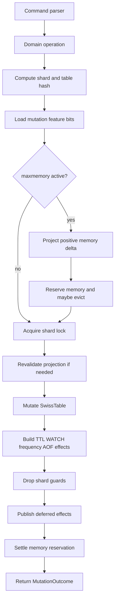
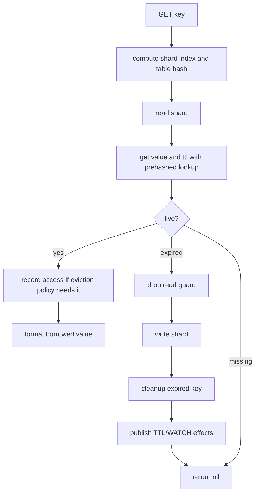

# Command And Domain Execution

The command layer in `vortex-engine` is split into two parts:

- `commands/*`: parse already-framed RESP arguments, apply Redis command syntax, shape RESP replies, and encode AOF command payloads.
- `engine::domain/*`: perform typed operations over `ConcurrentKeyspace`, including shard locks, memory admission, TTL transitions, WATCH invalidation, LSN stamping, and table mutation.

This replaced the old command-context shape. Command modules should stay focused on protocol semantics. Domain modules own the data-engine mechanics.

## Entry Point

```rust
pub fn execute_command(
    keyspace: &ConcurrentKeyspace,
    name: &[u8],
    frame: &FrameRef<'_>,
    clock: impl Into<CommandClock>,
) -> Option<ExecutedCommand>
```

Inputs:

| Input | Meaning |
| --- | --- |
| `keyspace` | Shared engine state. |
| `name` | Uppercase ASCII command name. The caller normalizes it before entering the engine. |
| `frame` | Zero-copy RESP frame view from `vortex-proto`. |
| `clock` | Monotonic and Unix nanosecond clock values supplied by the reactor. |

Output:

- `Some(ExecutedCommand)` when the engine recognizes the command.
- `None` for unknown commands or connection-state commands that the reactor owns, such as `MULTI` and `WATCH`.

`EXEC`, `DISCARD`, and `UNWATCH` have stateless fallback handlers for Redis-compatible behavior outside active transaction state. The real in-transaction implementation lives in `vortex-io` because it is connection-scoped.

## Command Modules

| Module | Commands and role |
| --- | --- |
| `commands/mod.rs` | Static dispatch, response types, argument helpers, shared RESP constants, AOF payload encoders. |
| `commands/string.rs` | `GET`, `SET`, `MGET`, `MSET`, `INCR`, `APPEND`, `GETEX`, `SETRANGE`, and related string commands. |
| `commands/generic.rs` | `DEL`, `EXISTS`, TTL commands, `TYPE`, `RENAME`, `SCAN`, `KEYS`, `RANDOMKEY`, `TOUCH`, `COPY`. |
| `commands/server.rs` | `DBSIZE`, `FLUSHDB`, `FLUSHALL`, `INFO`, `COMMAND`, `TIME`. |
| `commands/connection.rs` | Stateless connection-compatible commands such as `PING`, `ECHO`, `QUIT`, `SELECT`. |
| `commands/transaction.rs` | Stateless transaction fallbacks and documentation for reactor-owned transaction behavior. |
| `commands/pattern.rs` | Glob matching used by `KEYS` and `SCAN`. |

The dispatcher is a static `match` on command bytes. There is no handler registry, trait object, or per-command allocation for dispatch.

## Response Types

`CmdResult` has three tiers:

```rust
pub enum CmdResult {
    Static(&'static [u8]),
    Inline(InlineResp),
    Resp(RespFrame),
}
```

| Variant | Use | Cost |
| --- | --- | --- |
| `Static` | Fixed replies such as `+OK`, nil, small integer constants, and common errors. | No allocation or formatting. |
| `Inline` | Tiny dynamic bulk replies in a 32-byte stack buffer. | No heap allocation. |
| `Resp` | Larger or structured dynamic replies. | Allocates or owns a `RespFrame`. |

`ExecutedCommand` wraps `CmdResult` with:

- `aof_commit: Option<AofCommitEffect>`
- `aof_records: AofRecords`
- `aof_payload: Option<Box<[u8]>>`

This lets the engine return the wire response and persistence metadata together without writing files itself.

## Argument Strategy

Handlers avoid collecting arguments when a fixed small shape is enough:

- `arg_bytes(frame, index)`
- `arg_count(frame)`
- `arg_i64(frame, index)`

For option-rich or variable-arity commands, handlers use `CommandArgs::collect(frame)`, backed by `SmallVec<[&[u8]; 8]>`.

The engine stores integer-looking byte strings as `VortexValue::Integer` when possible. That makes common counters allocation-free.

## Domain Modules

`engine::domain` is private to the crate. It contains inherent methods on `ConcurrentKeyspace` and helper functions. The important point is that this is still zero-cost Rust: no boxed operation objects and no dynamic dispatch are added between command parsing and table mutation.

| Domain file | Role |
| --- | --- |
| `mutation.rs` | Shared mutation effects, memory reservation coordinator, TTL state, SET options, error mapping, deferred publication hooks. |
| `string_ops.rs` | String reads, SET, MGET/MSET/MSETNX, increments, append, range operations. |
| `string_tables.rs` | Table-local string projection, prepared value mutations, duplicate MSET handling, SET option table helpers. |
| `key_ops.rs` | Deletes, existence checks, expiry, persist, type, rename, copy, and key movement. |
| `scan_ops.rs` | SCAN cursor encoding, pattern/type filtering, random key lookup, KEYS collection. |
| `admin_ops.rs` | DBSIZE, FLUSH, and INFO keyspace helpers. |

## Mutation Pipeline

Most mutations follow the same shape:


```mermaid
flowchart TD
    A[Command parser] --> B[Domain operation]
    B --> C[Compute shard and table hash]
    C --> D[Load mutation feature bits]
    D --> E{maxmemory active?}
    E -- yes --> F[Project positive memory delta]
    F --> G[Reserve memory and maybe evict]
    E -- no --> H[Acquire shard lock]
    G --> H
    H --> I[Revalidate projection if needed]
    I --> J[Mutate SwissTable]
    J --> K[Build TTL WATCH frequency AOF effects]
    K --> L[Drop shard guards]
    L --> M[Publish deferred effects]
    M --> N[Settle memory reservation]
    N --> O[Return MutationOutcome]
```

This design keeps cold effects out of the shard critical section when correctness allows it.

## Deferred Effects

Mutations produce `MutationEffects` while holding table locks, then publish them after dropping the locks.

Effects can include:

- TTL counter transition
- WATCH invalidation
- LFU frequency update
- AOF commit LSN

There are borrowed and owned forms:

- `DeferredEffects<'a>` borrows watched key bytes or keys that are still alive long enough.
- `OwnedDeferredEffects` owns watched keys when a batch must drop guards and source data before publication.

The `#[must_use]` marker on these types is intentional: forgetting to publish an effect can break TTL counts, WATCH correctness, or AOF ordering.

## LSN Allocation In Mutations

Domain code calls:

```rust
allocate_observed_mutation_lsn_with_features(features)
```

It returns:

```text
(entry_lsn: Option<u64>, aof_lsn: Option<AofLsn>)
```

Rules:

- If neither WATCH nor AOF is active, both are `None`.
- If WATCH is active, an entry LSN is allocated and stamped on the live entry so WATCH validation can observe it.
- If AOF is active, an `AofLsn` is returned so the reactor can append the command in mutation order.
- Some deletion-only operations produce AOF LSNs without an entry to stamp.

Plain featureless `SET key value` therefore avoids the global LSN atomic.

## GET Path

`GET` uses `read_value_with` for borrowed response formatting:


```mermaid
flowchart TD
    A[GET key] --> B[compute shard index and table hash]
    B --> C[read shard]
    C --> D[get value and ttl with prehashed lookup]
    D --> E{live?}
    E -- yes --> F[record access if eviction policy needs it]
    F --> G[format borrowed value]
    E -- expired --> H[drop read guard]
    H --> I[write shard]
    I --> J[cleanup expired key]
    J --> K[publish TTL/WATCH effects]
    K --> L[return nil]
    E -- missing --> L
```

The common hit path does not clone the value. The command encodes the borrowed value while the read guard is held.

## Plain SET Fast Path

Plain `SET key value` has a special path:

- no option parsing
- no TTL option state
- no read-to-write expiry cleanup
- prehash before lock
- if mutation features are empty, avoid memory reservation, WATCH, and AOF work
- for larger raw byte values, `RawValueBytes` can reuse the existing `Bytes` allocation when possible

The fast path is still correct for expired keys because plain SET overwrites unconditionally and clears TTL. It only needs to publish an expiry transition if the old entry had a TTL.

## SET With Options

Option-rich SET parses:

- `EX`, `PX`, `EXAT`, `PXAT`
- `NX`, `XX`
- `GET`
- `KEEPTTL`

Those are packed into `SetOptions`. Domain code uses a `SlotCursor`:

- live slot: apply NX/XX/GET/KEEPTTL semantics against the current value
- expired slot: remove expired entry, then treat as absent
- vacant slot: insert if the options allow it

The result is `SetResult`, which says whether SET happened and whether a previous/current value should be returned.

## Batch Read: MGET

`MGET` does not loop over `GET`.

It:

1. Builds one lookup record per key: output index, shard index, and table hash.
2. Sorts lookup records by shard.
3. Processes one shard at a time under one read lock.
4. Prefetches table groups for the shard-local keys.
5. Fills the output vector in original command order.
6. Records expired hits.
7. Performs batched lazy-expiry cleanup with one write lock per affected shard.

This keeps response order stable while reducing lock churn and redundant hash work.

## Batch Write: MSET And MSETNX

`MSET` uses `PrehashedShardPlan` and sorted write guards. When maxmemory admission is active, it deduplicates duplicate keys by last write before projecting memory so `MSET a small a huge` reserves for the final state, not the sum of both writes.

`MSETNX` is all-or-nothing:

1. Deduplicate duplicate keys by last write.
2. Read-plan all keys and verify no live target exists.
3. Reserve memory for the full insert set.
4. Revalidate absence under write locks.
5. Insert all keys or insert none.

Both paths allocate one logical AOF commit LSN for the batch when AOF is active.

## Value-Dependent Mutations

Commands such as `APPEND`, `SETRANGE`, `INCRBYFLOAT`, and `INCRBY` need to inspect the current value before deciding the new value and memory delta.

The locked fallback path is:

```text
read current state -> project delta -> reserve -> write lock -> revalidate -> mutate
```

For selected value mutations, the engine can use an optimistic prepare/revalidate/swap path when maxmemory and replay mode are inactive:

```text
read lock
  -> clone current value/ttl/lsn snapshot
  -> compute new value outside write lock
  -> write lock
  -> revalidate value, ttl, and lsn
  -> swap prepared value if unchanged
  -> retry a small number of times on conflict
```

This is currently used for `INCRBYFLOAT` and `SETRANGE`. If revalidation fails or the optimization is disabled, the code falls back to the locked path.

## TTL Commands

TTL commands are implemented in `generic.rs` and domain `key_ops.rs`.

The domain uses:

- `TtlState::Missing`
- `TtlState::Persistent`
- `TtlState::Deadline(deadline)`
- `ExpireOptions` for `NX`, `XX`, `GT`, and `LT`

`EXPIRE` with a deadline at or before `now_nanos` deletes the key. Future deadlines update the entry TTL and stamp an LSN if WATCH or AOF is active. `PERSIST` clears a TTL only if a live TTL existed.

## Delete, Rename, And Copy

`DEL` and `UNLINK` share delete mechanics. Single-key delete uses the direct byte path. Multi-key delete uses a prehashed plan, sorted write locks, and deferred effects.

`RENAME` and `RENAMENX` support same-shard and cross-shard paths:

- same shard: one write guard
- cross shard: sorted multi-write guards plus helper splitting to obtain distinct mutable table references

Memory admission is based on the final state: source removed, destination inserted or replaced, and TTL carried forward if it is still live. Projection and revalidation use the same prehashed table lookups as the eventual commit, so the locked admission pass does not repeat table hashing.

`COPY` follows the same admission shape without removing the source:

- prepare a source value, TTL, and LSN snapshot before the write guard when the destination does not already block the command
- reserve projected destination growth before acquiring write guards
- revalidate source value, TTL, and LSN under the write guard before using the prepared copy
- fall back to a locked source clone when the optimistic source snapshot is stale
- update only the destination WATCH state and destination entry LSN

`RENAME` updates both source and destination WATCH state. `COPY` is intentionally read-only for the source key, so source WATCH registrations stay valid while destination watches are invalidated.

## SCAN, KEYS, RANDOMKEY

`SCAN` encodes its cursor as:

```text
upper 32 bits: shard index
lower 32 bits: slot index
```

The scan path walks shard tables by slot index, filters expired entries, applies optional glob and type filters, and returns a new cursor. It is incremental and not a global snapshot. In alpha, `COUNT` is a capped work hint: the command bounds per-response key material and sparse slot traversal, then returns a progress cursor when more work remains.

`KEYS` scans all shards and collects matching keys until the alpha response cap is reached. If another matching key is found after that cap, the command fails closed and asks callers to use `SCAN`; this bounds response material but does not make large `KEYS` a latency-proof surface. `RANDOMKEY` starts at a pseudo-random shard and pseudo-random slot, then searches for a live key.

## FLUSHDB And FLUSHALL

`FLUSHDB` and `FLUSHALL` are synchronous alpha admin commands. The reactor routes them through `CommandExecutionScope::FullExclusive`, so normal command readers wait at the transaction gate before the flush begins. The command-facing keyspace path then clears shards sequentially instead of retaining every shard write guard at once. This reduces shard-lock footprint, but it is still one synchronous command turn; command-level yielding or an async flush scheduler remains future work before large flushes can be included in latency/fairness claims.

## AOF Payloads And Side Records

The command layer encodes AOF command payloads such as:

- `SET`
- `SET ... PXAT`
- `PEXPIREAT`
- `PERSIST`

The engine returns:

- `aof_payload`: command bytes for persistence when the reactor needs an owned canonical command
- `aof_commit`: the mutation LSN for the command
- `aof_records`: side records, currently used for eviction deletes

The engine does not decide fsync policy. It only identifies what mutation happened and in what logical order.

## Error Mapping

Domain operations return `MutationErrorKind`:

- `WrongType`
- `NotInteger`
- `NotFloat`
- `Overflow`
- `OutOfMemory`
- `NoSuchKey`

The command layer maps those to Redis-compatible RESP errors. If eviction happened before an OOM result, the error can still carry AOF side records for keys evicted during the failed admission attempt.

## Hot-Path Rules

When changing command execution, preserve these rules:

- Parse RESP and shape replies in `commands/*`.
- Keep lock ordering and storage mutation in domain/keyspace/table code.
- Prehash before locking when the table hash is needed.
- Do not publish cold effects while a shard guard is live unless correctness requires it.
- Do not add LSN allocation to featureless writes.
- Do not bypass memory admission for command-visible growth.
- Do not hold shard guards across reactor yield or requeue points.
