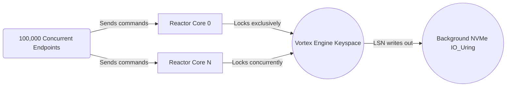

# Integration and Transactions

While `vortex-engine` maintains a strict encapsulation of the keyspace, the system works synergistically alongside other critical backend components of VortexDB, namely the Connection Reactor (`io_uring`) and the Protocol Parser (`vortex-proto`).

## Thread-Per-Core Integration

If Vortex is started on Server CPU with 128 Cores:
1. It spins up 128 `reactor` event loops.
2. Every loop has its own dedicated `io_uring` polling interface, memory allocator, and `std::net` connection mapping.
3. Once an incoming payload establishes network transmission, a reactor owns the connection entirely. Wait-free scaling is accomplished because all reactors only speak to each other by acting on `vortex_engine::ConcurrentKeyspace`. Because `ConcurrentKeyspace` handles the multithreaded locking through padding, the network nodes require absolutely 0 form of actor-message-passing.

## MULTI / EXEC Atomicity Flow

Because each Connection sits mapped to an individual Reactor, `vortex_engine` easily manages `MULTI / EXEC` flows.

1. When a client fires `MULTI`, the `reactor` intercepts the request by setting an internal state declaring `in_transaction = true`.
2. As commands arrive, rather than locking shards sequentially or placing intent flags (like DragonflyDB), the reactor natively aggregates the requests within a local memory queue buffer.
3. Eventually, the client triggers `EXEC`.
4. The reactor forwards all queued frames perfectly synchronized to `vortex_engine`, which executes `exec_transaction_locks(&keys)` against the keyspace, evaluating all keys simultaneously.
5. The deduplication guarantees one mass sorting event across all necessary locks.
6. The single massive locking barrier acts as a flawless Linearization point. No other process can observe half the transaction. Multi-key writes perform with true data immutability for the transaction boundary length, before seamlessly dropping back below the `CachePadded` 128-byte line.
