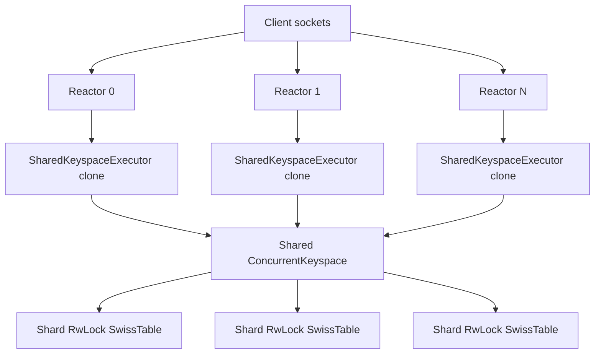
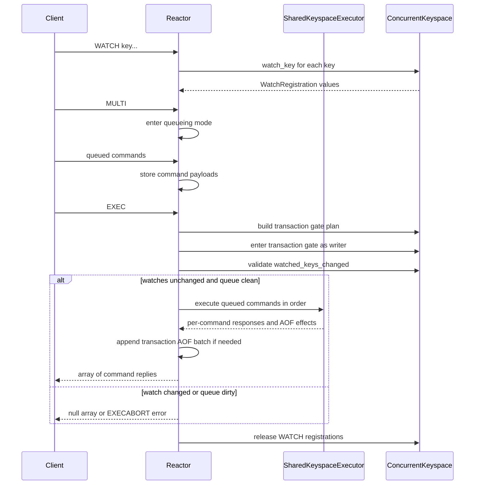
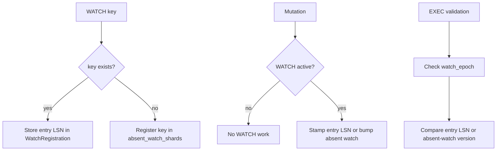

# Integration, Transactions, And Persistence Handoff

`vortex-engine` is intentionally pure in-memory code. It integrates with the rest of Vortex through typed boundaries:

- parsed RESP frames enter from `vortex-io` and `vortex-proto`
- responses and engine effects leave as `ExecutedCommand`
- AOF commit metadata leaves as typed LSN-bearing effects
- runtime metrics and memory attribution are published through `ConcurrentKeyspace`

The engine does not own per-connection transaction queues, sockets, write buffers, or fsync.

## Runtime Placement

The alpha server topology is:


```mermaid
flowchart TD
    Client[Client sockets] --> R0[Reactor 0]
    Client --> R1[Reactor 1]
    Client --> RN[Reactor N]

    R0 --> Exec0[SharedKeyspaceExecutor clone]
    R1 --> Exec1[SharedKeyspaceExecutor clone]
    RN --> ExecN[SharedKeyspaceExecutor clone]

    Exec0 --> KS[Shared ConcurrentKeyspace]
    Exec1 --> KS
    ExecN --> KS

    KS --> S0[Shard RwLock SwissTable]
    KS --> S1[Shard RwLock SwissTable]
    KS --> SN[Shard RwLock SwissTable]
```

Each reactor owns its connections and parser/write state. All reactors share one `Arc<ConcurrentKeyspace>` through `SharedKeyspaceExecutor`.

This keeps arbitrary Redis multi-key commands local to the receiving reactor. The receiving reactor does not need to route normal commands to a key owner thread before executing them.

## Executor Boundary

`SharedKeyspaceExecutor` is a transparent newtype over `Arc<ConcurrentKeyspace>`.

It provides:

- `execute(name, frame, clock)`: run a command with no transaction gate.
- `execute_scoped(scope, reactor_id, name, frame, clock)`: enter a transaction-gate scope and then run the command.
- `keyspace()`: cold access for maintenance, tests, and reactor coordination.

The executor is concrete, not a trait object. A future owner-shard or routing experiment should add a different executor/router at this boundary instead of teaching the IO backend, parser, table, or entry about routing.

## CommandExecutionScope

The reactor decides which transaction gate scope a command needs:

| Scope | Meaning |
| --- | --- |
| `None` | No gate. |
| `Keys(&[&[u8]])` | Gate the shards touched by these keys. |
| `Full` | Enter all shard command gates as readers. Used for whole-keyspace reads. |
| `FullExclusive` | Enter all shard transaction gates as writers. Used for whole-keyspace writes such as `FLUSHDB` and `FLUSHALL`. |

For `Keys`, the executor asks the keyspace to enter per-shard command gates as readers. `Full` uses all shard command gates as readers. `FullExclusive` excludes normal command readers before executing the command, which lets command-scoped full-keyspace mutations avoid retaining every shard write lock at once.

## Transaction Ownership

Redis transactions are connection-scoped. The reactor owns:

- whether a connection is in `MULTI`
- the queued command payloads
- queued bytes and queue limits
- dirty transaction state
- watched key registrations
- WATCH epoch captured for that connection
- transaction AOF batch assembly

The engine owns:

- WATCH registration data tied to keys and entry versions
- per-shard transaction gates
- stateless fallback replies for `EXEC`, `DISCARD`, and `UNWATCH`
- normal command execution for queued commands when the reactor drains an `EXEC`

This split keeps the normal GET/SET path free from per-connection transaction state.

## MULTI / EXEC Flow


```mermaid
sequenceDiagram
    participant C as Client
    participant R as Reactor
    participant E as SharedKeyspaceExecutor
    participant KS as ConcurrentKeyspace

    C->>R: WATCH key...
    R->>KS: watch_key for each key
    KS-->>R: WatchRegistration values
    C->>R: MULTI
    R->>R: enter queueing mode
    C->>R: queued commands
    R->>R: store command payloads
    C->>R: EXEC
    R->>KS: build transaction gate plan
    R->>KS: enter transaction gate as writer
    R->>KS: validate watched_keys_changed
    alt watches unchanged and queue clean
        R->>E: execute queued commands in order
        E-->>R: per-command responses and AOF effects
        R->>R: append transaction AOF batch if needed
        R-->>C: array of command replies
    else watch changed or queue dirty
        R-->>C: null array or EXECABORT error
    end
    R->>KS: release WATCH registrations
```

The transaction gate linearizes the validation point and queued mutation execution. Normal commands touching the same shards enter as readers and wait while the transaction writer gate is active. Commands touching unrelated shards are not blocked by a transaction gate for other shards.

## Transaction Gates

Each shard has one `TransactionGate`:

```text
active: AtomicBool
readers: AtomicUsize
```

Normal scoped commands:

1. Spin/yield while `active` is true.
2. Increment `readers`.
3. Re-check `active`.
4. Execute command.
5. Decrement `readers` on guard drop.

EXEC:

1. Sets `active` to true for each planned shard gate.
2. Waits until `readers == 0`.
3. Validates WATCH and executes queued commands.
4. Clears `active` in reverse acquisition order on guard drop.

The shard set is sorted and deduplicated, mirroring the multi-key lock-ordering rule.

## WATCH Integration

WATCH uses two validation mechanisms.


```mermaid
flowchart TD
    Watch[WATCH key] --> Present{key exists?}
    Present -- yes --> Entry[Store entry LSN in WatchRegistration]
    Present -- no --> Absent[Register key in absent_watch_shards]

    Mut[Mutation] --> Feature{WATCH active?}
    Feature -- no --> Skip[No WATCH work]
    Feature -- yes --> Stamp[Stamp entry LSN or bump absent watch]

    Exec[EXEC validation] --> Epoch[Check watch_epoch]
    Epoch --> Compare[Compare entry LSN or absent-watch version]
```

Present keys are cheap: validation reads the current entry LSN from the shard table. Absent keys are cold: the keyspace uses a sharded `HashMap` only for keys that were missing when WATCH ran.

`watch_epoch` invalidates all watches for whole-keyspace mutations such as FLUSH.

## AOF Handoff

The engine creates AOF effects but does not write AOF files.

Mutation result path:

```text
domain mutation
  -> maybe allocate AofLsn
  -> maybe encode canonical AOF payload
  -> maybe produce side AOF records
  -> return ExecutedCommand
  -> reactor appends according to current AOF writer policy
```

`AofCommitEffect` means "this command mutation committed in memory and should be appended by the reactor if AOF is enabled." `AofRecord` side records currently represent engine-side eviction deletes that are not part of the original client command payload.

The durability questions remain outside the engine:

- fsync policy
- external commit point
- loss window
- replay ordering across files
- truncation and corruption behavior
- rewrite/snapshot swap behavior

Those are `vortex-persist` and reactor/AOF coordinator contracts.

## Runtime AOF Feature Bit

The keyspace tracks active AOF recording with `aof_recording_refs`.

- `enable_aof_recording()` increments the refcount and enables the AOF mutation feature on the transition from zero to one.
- `disable_aof_recording()` decrements and disables the feature on the transition back to zero.

When the AOF feature is off, mutations that have no WATCH observer skip AOF LSN allocation.

## Replay Mode

`enter_replay_mode()` returns `ReplayModeGuard`. While replay mode is active:

- maxmemory admission is bypassed
- synchronous eviction is bypassed
- mutations restore persisted data without being rejected by runtime cache policy

After replay, startup can restore the global LSN frontier with `restore_lsn_after_replay(max_replayed_lsn)`. That call is unsafe because it must happen during single-threaded startup or while all reactors are quiesced.

## Maintenance Integration

Reactors drive engine maintenance in bounded slices.

### Active Expiry

`run_active_expiry_on_shard` removes expired keys from one shard. It returns:

```text
(expired_count, sampled_count)
```

The reactor records the counts in runtime metrics and controls how much expiry work runs per activation.

### Eviction Maintenance

`run_eviction_maintenance_on_shard` attempts bounded pressure relief when maxmemory is active and pressure is above the limit. It returns `EvictionMaintenanceSlice`:

- AOF side records for evicted keys
- shards scanned
- slots sampled
- bytes freed
- whether pressure remained over limit after scan

Admission-time eviction and maintenance-time eviction use the same sweep mechanics, so behavior stays consistent.

### Metrics Flush

Reactors publish local counters through methods such as:

- `flush_reactor_local_metrics`
- `publish_reactor_aof_telemetry`
- `publish_reactor_overload_telemetry`

Hot loop, batch, and budget-exhaustion diagnostics are carried inside
`RuntimeLocalFlushMetrics` and published on the cold metrics-maintenance path.
The keyspace aggregates these into `RuntimeMetricsSnapshot`.

## Memory Attribution Integration

The engine reports engine-local memory through `engine_memory_attribution()`:

- live keys
- logical dataset bytes
- table allocated bytes
- table total slots
- capacity slack slots
- tombstone slots
- load factor
- bytes per live key
- shard count

The reactor pool reports IO/server memory through `set_server_memory_attribution()`:

- fixed buffer reserved, committed, and active bytes
- per-connection state bytes
- connection capacity
- fixed buffer count and size

Public memory comparisons should say whether they use engine-only numbers or full-server RSS.

## INFO Integration

`commands/server.rs` shapes `INFO` output from keyspace snapshots. It pulls together:

- keyspace counts
- memory attribution
- runtime backend contract
- reactor fairness counters
- AOF telemetry
- overload counters
- active expiry counters
- eviction counters

The command layer formats the response, but the authoritative data lives in the keyspace.

## Boundary Rules

When integrating engine changes with other crates:

- The reactor may hold connection and parser state. The engine may not.
- The engine may return AOF effects. It may not fsync or write files.
- The keyspace may expose transaction gates. It may not own queued transaction payloads.
- Domain operations may mutate tables. Command modules should not bypass the domain layer for visible mutations.
- Shard guards must not cross reactor yield, requeue, or async completion boundaries.
- AOF writer leases and response iovecs must not be held under shard locks.
- Performance claims require benchmark artifacts; profiler notes explain them but do not replace them.

## Known Alpha Boundaries

The current architecture is intentionally shared-keyspace alpha, not shared-nothing:

- arbitrary multi-key commands stay local to the receiving reactor
- sorted shard locks preserve deterministic multi-key behavior
- per-shard transaction gates avoid a global normal-command gate
- future owner-shard experiments should happen behind the executor/router boundary

The remaining alpha risks are not hidden by this document:

- memory footprint still needs continued table/layout and full-server attribution work
- transaction and WATCH pressure need release-grade repeat benchmarks
- AOF `always` is storage-bound and must be reported separately from no-AOF latency
- advanced IO backend tiers must be proven by same-workload profiles before becoming default claims
