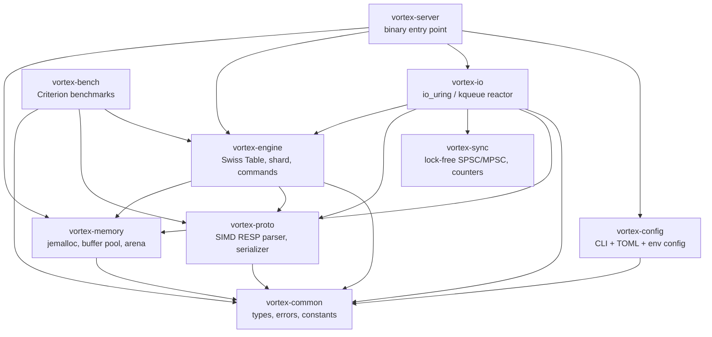
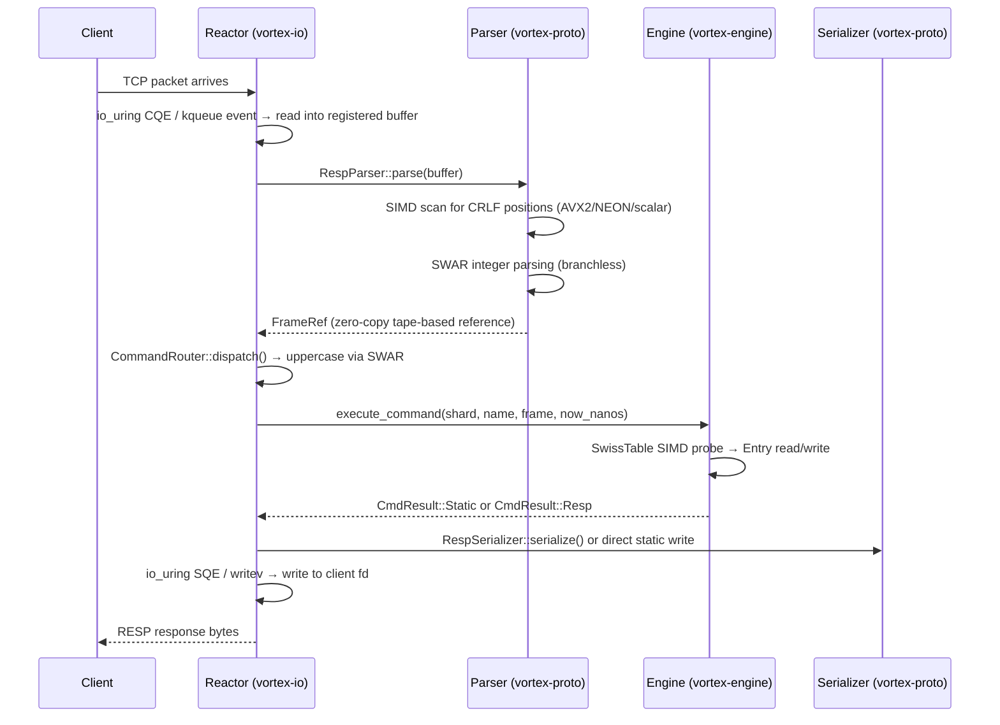

# VortexDB Architecture Guide

This document describes the internal architecture of VortexDB — how crates are organized, how data flows through the system, and why specific design decisions were made.

---

## Crate Map

VortexDB is a 17-crate Rust workspace with strict layered dependencies. Lower layers never depend on upper layers.



| Crate | Purpose | Key Types |
|-------|---------|-----------|
| `vortex-common` | Foundation types shared by all crates | `VortexKey`, `VortexValue`, `VortexError`, `ShardId`, `Timestamp`, `Encoding` |
| `vortex-memory` | Memory allocation strategy | `BufferPool`, `ArenaAllocator`, `NumaTopology`, `GlobalAllocator` |
| `vortex-sync` | Lock-free concurrent primitives | `SpscRingBuffer`, `MpscQueue`, `ShardedCounter`, `ShutdownSignal`, `Backoff` |
| `vortex-proto` | RESP2/RESP3 wire protocol | `RespParser`, `RespSerializer`, `RespFrame`, `CommandRouter`, `IovecWriter` |
| `vortex-config` | Configuration loading | `VortexConfig`, `IoBackendKind` |
| `vortex-engine` | Core data engine | `SwissTable`, `Entry`, `Shard`, `ExpiryWheel`, `AccessProfile` |
| `vortex-io` | Thread-per-core I/O reactor | `Reactor`, `ReactorPool`, `IoBackend`, `TimerWheel` |
| `vortex-server` | Server binary entry point | `main()` |
| `vortex-bench` | Criterion benchmark suite | 69 benchmarks |

---

## Threading Model: Thread-Per-Core

VortexDB uses a **thread-per-core** architecture. Each CPU core runs exactly one reactor thread that owns its own:

- **io_uring instance** (Linux) or **kqueue poller** (macOS)
- **Shard** — an independent Swiss Table with its own data partition
- **BufferPool** — pre-allocated, mmap'd, page-aligned I/O buffers
- **ArenaAllocator** — bump allocator for per-iteration transient allocations
- **TimerWheel** — hierarchical timing wheel for connection timeouts
- **Connection slab** — dense array of active client connections

No mutexes exist on the hot path. Each reactor is fully independent.

```
┌─────────────────────────────────────────────────────────────┐
│                     ReactorPool                              │
│  ┌────────────┐  ┌────────────┐       ┌────────────┐       │
│  │ Reactor 0   │  │ Reactor 1   │  ...  │ Reactor N   │    │
│  │  CPU Core 0 │  │  CPU Core 1 │       │  CPU Core N │    │
│  │             │  │             │       │             │     │
│  │ ┌─────────┐│  │ ┌─────────┐│       │ ┌─────────┐│     │
│  │ │  Shard  ││  │ │  Shard  ││       │ │  Shard  ││     │
│  │ └─────────┘│  │ └─────────┘│       │ └─────────┘│     │
│  │ ┌─────────┐│  │ ┌─────────┐│       │ ┌─────────┐│     │
│  │ │BufferPool││  │ │BufferPool││       │ │BufferPool││     │
│  │ └─────────┘│  │ └─────────┘│       │ └─────────┘│     │
│  │ ┌─────────┐│  │ ┌─────────┐│       │ ┌─────────┐│     │
│  │ │io_uring/ ││  │ │io_uring/ ││       │ │io_uring/ ││     │
│  │ │ kqueue   ││  │ │ kqueue   ││       │ │ kqueue   ││     │
│  │ └─────────┘│  │ └─────────┘│       │ └─────────┘│     │
│  └────────────┘  └────────────┘       └────────────┘       │
│                                                              │
│  Cross-reactor SPSC mesh: N×(N-1) ring buffers, 4096 cap    │
└─────────────────────────────────────────────────────────────┘
```

### CPU Pinning

Each reactor thread is pinned to a specific CPU core via `core_affinity::set_for_current(CoreId)`. This ensures:

- L1/L2 cache locality for the shard's hot data
- Deterministic scheduling — no OS thread migration
- Predictable latency — no cross-core cache-line bouncing

### Cross-Reactor Communication

Reactors communicate via a mesh of lock-free SPSC ring buffers (`SpscRingBuffer<CrossMessage, 4096>`). Each pair of reactors has a dedicated unidirectional channel. Current message types:

- `CrossMessage::Shutdown` — graceful shutdown signal
- `CrossMessage::Ping` — health check (future use)

---

## Request Lifecycle

A complete client request flows through these stages:



### Stage Details

1. **I/O Completion** — The reactor drains CQEs (io_uring) or events (kqueue). Each completion carries a 64-bit token encoding `(conn_id:32 | generation:24 | op_type:8)`. The generation field prevents processing stale completions from recycled connection slots.

2. **Parsing** — The `RespParser` performs a single SIMD scan pass to locate all `\r\n` positions in the buffer, then uses those positions to slice frames at memory bandwidth. Integer lengths are parsed via SWAR (SIMD-Within-A-Register) — branchless using 64-bit register tricks. The result is a `FrameRef` — a zero-copy reference into the original buffer via a tape-based representation.

3. **Command Routing** — The `CommandRouter` normalizes the command name to uppercase using SWAR (processes 8 bytes at a time, branchless), then dispatches via a PHF (Perfect Hash Function) lookup table containing ~160 known Redis commands with arity validation and key-range extraction.

4. **Engine Execution** — The command handler executes against the reactor's local `Shard`. The `Shard` wraps a `SwissTable` (SIMD-probed hash map) and an `ExpiryWheel` (dual timing wheel for TTLs). Each key lookup is a single SIMD comparison of 16 control bytes, followed by an inline entry read from a 64-byte cache line.

5. **Response** — Pre-computed responses (`+OK\r\n`, `$-1\r\n`, `:0\r\n`, etc.) are returned as `CmdResult::Static` — a pointer to read-only memory, zero allocation. Dynamic responses are serialized via `RespSerializer` with scatter-gather I/O support (`IovecWriter` → `writev` / io_uring `IORING_OP_WRITEV`).

6. **Write** — The response bytes are submitted to io_uring as a write SQE or written via `writev` syscall on the polling backend.

---

## I/O Backend Abstraction

The `IoBackend` trait abstracts over two implementations:

| Backend | Platform | Mechanism | Syscalls in Hot Path |
|---------|----------|-----------|----------------------|
| `IoUringBackend` | Linux 5.6+ | io_uring submission/completion queues | 0 (kernel polls SQEs) |
| `PollingBackend` | macOS, Linux fallback | kqueue / epoll + `read`/`write`/`writev` | 1 per I/O op |

### Token Encoding (64-bit)

```
Bits 63–32: conn_id   (32-bit connection slot index)
Bits 31–8:  generation (24-bit reuse counter, prevents stale CQE processing)
Bits 7–0:   op_type    (Accept=0, Read=1, Write=2, Close=3, Writev=4)
```

### IoBackend Trait

```rust
pub trait IoBackend: Send {
    fn submit_accept(&mut self, fd: RawFd, token: u64) -> io::Result<()>;
    fn submit_read(&mut self, fd: RawFd, buf: *mut u8, len: usize, token: u64) -> io::Result<()>;
    fn submit_write(&mut self, fd: RawFd, buf: *const u8, len: usize, token: u64) -> io::Result<()>;
    fn submit_read_fixed(&mut self, fd: RawFd, buf: *mut u8, len: usize, buf_index: u16, token: u64) -> io::Result<()>;
    fn submit_write_fixed(&mut self, fd: RawFd, buf: *const u8, len: usize, buf_index: u16, token: u64) -> io::Result<()>;
    fn submit_writev(&mut self, fd: RawFd, iovecs: *const libc::iovec, count: usize, token: u64) -> io::Result<()>;
    fn submit_close(&mut self, fd: RawFd, token: u64) -> io::Result<()>;
    fn completions(&mut self, out: &mut Vec<Completion>) -> io::Result<usize>;
    fn submit(&mut self) -> io::Result<usize>;
}
```

### Fixed Buffer Registration (io_uring)

On Linux, the `BufferPool` pre-allocates page-aligned, `mlock`'d buffers and registers them with the kernel via `io_uring_register_buffers`. This allows `ReadFixed`/`WriteFixed` operations where the kernel DMAs directly into userspace memory — zero copies between kernel and userspace.

---

## Data Engine

### Swiss Table — SIMD-Probed Hash Map

The core data structure is a Swiss Table — an open-addressing hash table where each "group" of 16 slots has a 16-byte control array that fits exactly in one SSE2/NEON register.

```
Group Layout (16 slots):
┌────────────────────────────────────────────┐
│ Control bytes: [c₀ c₁ c₂ ... c₁₅]  16B   │  ← One SIMD register
├────────────────────────────────────────────┤
│ Entry 0:  [64 bytes, cache-line aligned]   │
│ Entry 1:  [64 bytes, cache-line aligned]   │
│ ...                                        │
│ Entry 15: [64 bytes, cache-line aligned]   │
└────────────────────────────────────────────┘
```

**Lookup algorithm:**
1. Hash the key → extract H₁ (group index) and H₂ (7-bit fingerprint, range `0x81..=0xFE`)
2. Load the 16 control bytes into a SIMD register
3. Broadcast H₂ into another SIMD register
4. Single SIMD compare → 16-bit bitmask of matching slots
5. Check matching slots for full key equality
6. If no match, follow triangular probe sequence to next group

**Control byte values:**
- `0xFF` — EMPTY (slot never written)
- `0x80` — DELETED (tombstone)
- `0x81..=0xFE` — H₂ fingerprint of the stored key

**Load factor:** 87.5% (7/8) — resize when exceeded.

**Platform SIMD implementations:**
- **x86-64:** `_mm_cmpeq_epi8` + `_mm_movemask_epi8` (SSE2, baseline ISA)
- **aarch64:** `std::simd` portable SIMD (compiles to NEON `vceqq_u8`)
- **fallback:** Scalar byte-by-byte comparison

### 64-Byte Cache-Line Entry

Every slot is a 64-byte, `#[repr(C, align(64))]` `Entry` that stores key + value + TTL + metadata inline:

```
Offset  Size  Field          Description
──────  ────  ─────          ───────────
 0       1    control        H₂ fingerprint or EMPTY/DELETED
 1       1    key_len        Inline key length (0..=23), 0 for heap keys
 2       2    flags          Inline/heap/integer markers, value type, TTL flag
 4       4    _pad0          Reserved (stores AccessProfile for morphing)
 8       8    ttl_deadline   Absolute nanosecond deadline, 0 = no expiry
16      23    key_data       Inline key bytes or heap pointer metadata
39       1    value_tag      Inline value length, HEAP sentinel, or INTEGER sentinel
40      21    value_data     Inline value bytes, i64, or heap pointer
61       3    _pad1          Padding to 64 bytes
```

**Inline optimization:** For keys ≤23 bytes and values ≤21 bytes (covers >60% of real-world Redis workloads), a lookup touches exactly **two cache lines** — one for the control group, one for the entry. Zero pointer chasing, zero heap allocation.

**Heap spill:** Keys >23 bytes or values >21 bytes are stored on the heap. The entry stores a raw pointer to the heap-allocated data. On table resize, heap pointers are rewritten to point to the new slot-owned data.

**Value types stored in flags bits 12–15:**

| Value | Type |
|-------|------|
| 0 | String |
| 1 | List |
| 2 | Hash |
| 3 | Set |
| 4 | Sorted Set |
| 5 | Stream |

### Shard

A `Shard` is the unit of data ownership — one per reactor. It wraps:

- `SwissTable` — the hash table
- `ExpiryWheel` — dual timing wheel for TTL management
- An expired entries buffer for active expiry sweeps

```rust
pub struct Shard {
    pub id: ShardId,
    data: SwissTable,
    expiry: ExpiryWheel,
    expired_buf: Vec<ExpiryEntry>,
}
```

**Lazy expiry:** Every `get()` checks the entry's `ttl_deadline` against the current time. Expired keys are removed on read — O(1), no background scan needed for point queries.

**Active expiry:** The reactor runs up to 3 expiry sweeps per event loop iteration, sampling 20 random keys per sweep. If >25% of sampled keys are expired, it re-sweeps (adaptive effort).

### TTL — Dual Timing Wheel

```
Seconds wheel: 65,536 slots × 1 sec resolution  (≈18.2 hours)
Millis wheel:  1,024 slots  × 1 ms resolution   (≈1.024 seconds)
```

- Keys with TTL ≥ 1 second → seconds wheel
- Keys with sub-second TTL (PX/PXAT) → millis wheel
- **O(1) register, O(budget) tick drain**
- Ghost detection: stale wheel entries detected by comparing the wheel entry's deadline against the live entry's `ttl_deadline` in the Swiss Table

---

## Wire Protocol — SIMD-Accelerated RESP

### Parser Pipeline

The `RespParser` processes RESP2/RESP3 frames using a multi-stage SIMD pipeline:

1. **CRLF Scan** — `scan_crlf()` uses platform-specific SIMD to locate all `\r\n` positions in a single pass:
   - **x86-64 AVX2:** 32 bytes per cycle via `_mm256_cmpeq_epi8`
   - **x86-64 SSE2:** 16 bytes per cycle (fallback)
   - **aarch64 NEON:** 16 bytes per cycle via portable `std::simd`
   - **Scalar:** Byte-by-byte (any platform)

2. **Integer Parsing** — `swar_parse_int()` converts ASCII digit strings to integers using SWAR (SIMD Within A Register) — branchless arithmetic in a single 64-bit register.

3. **Frame Materialization** — The tape-based parser (`RespTape`) produces `FrameRef` — zero-copy references into the original buffer. No allocations for frame parsing.

### Serializer

The `RespSerializer` supports two output paths:

- **Direct write** — For small, simple responses (`+OK\r\n`, `:0\r\n`), writes directly to the connection's write buffer.
- **Scatter-gather** — For multi-part responses (arrays, pipelines), `IovecWriter` accumulates `iovec` slices submitted via `writev` / io_uring `IORING_OP_WRITEV`. Zero-copy for bulk strings.

**Integer LUT:** A compile-time lookup table (`build_int_lut()`) maps integers 0–9999 to their pre-encoded RESP wire bytes, eliminating `itoa` overhead for common integer responses.

### Command Dispatch

The `CommandRouter` dispatches commands via a compile-time PHF (Perfect Hash Function) table:

1. Normalize command name to uppercase via SWAR (8 bytes at a time, branchless)
2. PHF lookup → `CommandMeta` (arity, flags, key range)
3. Arity validation
4. Dispatch to handler

The PHF table contains ~160 known Redis commands. Unknown commands return `-ERR unknown command`.

---

## Memory Architecture

### Global Allocator — jemalloc

VortexDB uses `tikv-jemallocator` as the global allocator. jemalloc provides:

- Thread-local caching — eliminates malloc contention across reactor threads
- Arena-based allocation — each thread gets its own allocation arena
- Predictable fragmentation — critical for long-running database processes

### Buffer Pool — mmap Backed

Each reactor owns a `BufferPool` of pre-allocated, page-aligned buffers:

- Allocated via `mmap(MAP_PRIVATE | MAP_ANONYMOUS)`
- Page-aligned (4 KiB boundaries) for io_uring DMA
- Pinned in physical memory via `mlock` to prevent page faults on the hot path
- Registered with the kernel via `io_uring_register_buffers` for zero-copy I/O
- Each connection leases 2 buffers: read + write (default 16 KiB each)

### Arena Allocator — Per-Iteration Bump

Each reactor owns an `ArenaAllocator` (default 1 MiB) for transient allocations that live for a single event loop iteration:

- **O(1) allocation** — pointer bump with alignment
- **O(1) reset** — single pointer reset at the end of each iteration
- **Overflow fallback** — if the arena is exhausted, falls back to `Vec<u8>` heap allocation

---

## Concurrency Primitives

### SPSC Ring Buffer

`SpscRingBuffer<T, N>` — lock-free, single-producer/single-consumer ring buffer with compile-time capacity `N` (must be power of 2):

- `CachePadded` head/tail atomics prevent false sharing
- Used for cross-reactor messaging (4096 capacity per channel)

### MPSC Queue

`MpscQueue<T>` — multi-producer, single-consumer lock-free queue backed by `crossbeam_queue::SegQueue`:

- Used for work-stealing scenarios (future phases)
- Unbounded, allocation-per-push

### Sharded Counter

`ShardedCounter` — per-core atomic counters with cache-padded slots:

- Per-slot increment is contention-free (no CAS)
- Aggregate read is O(cores) — used for metrics

### Shutdown Signal

`ShutdownSignal` — atomic flag + fd notification for cross-thread wakeup:

- Linux: `eventfd`
- macOS: pipe pair
- `swap(true, Ordering::Release)` avoids redundant fd writes

---

## Startup Flow

```
1. VortexConfig::load()
   └── CLI args (clap) > env vars (VORTEX_*) > TOML file > defaults
   └── validate() — ring_size power-of-2, buffer_size ≥ 4096, etc.

2. Initialize tracing (log_level from config)

3. Print ASCII banner

4. ReactorPool::spawn(config)
   └── For each CPU core:
       ├── Create IoBackend (io_uring or polling)
       ├── Create BufferPool (mmap + mlock + register)
       ├── Create Shard (SwissTable + ExpiryWheel)
       ├── Spawn thread, pin to core
       └── Enter Reactor::run() event loop

5. Signal handler (Ctrl-C)
   ├── First signal: ShutdownCoordinator::shutdown() → graceful drain
   └── Second signal: force-kill after 30s timeout

6. Wait for all reactor threads to join

7. Exit
```

---

## Active Expiry Hook

Each reactor event loop iteration:

```
1. Drain I/O completions (io_uring CQEs or kqueue events)
2. Process commands for each connection with data
3. Run active expiry sweep:
   ├── Sample 20 random keys from the shard
   ├── Remove expired keys
   ├── If >25% were expired, re-sweep (up to 3 sweeps)
   └── This ensures expired keys are cleaned up even without reads
4. Submit batched I/O operations
5. Reset arena allocator
```

---

## Adaptive Morphing Framework

The `AccessProfile` is a 32-bit compact structure stored in each entry's padding field (`_pad0`), at zero overhead:

```
Bits 0–3:   read_log₂ (saturating counter, 0–15)
Bits 4–7:   write_log₂ (saturating counter, 0–15)
Bit 8:      sequential access hint
Bits 9–11:  size_class (0–7)
Bits 12–15: current Encoding
Bits 16–25: access_count (wrapping, fires every 1024 accesses)
Bits 26–31: reserved
```

The `MorphMonitor` trait decides when a data structure should transition between encodings (e.g., list: FlatArray → UnrolledList → BPlusTree). In Phase 3, only the framework is in place — actual morphing transitions are implemented in Phase 4+.

---

## Software Prefetch

The `prefetch` module wraps platform-specific prefetch intrinsics:

- **x86-64:** `_mm_prefetch(ptr, _MM_HINT_T0)` (L1 cache prefetch)
- **aarch64:** `_prefetch(ptr, READ/WRITE, LOCALITY_L1)` (ARM prefetch)
- **Other:** No-op (safe on all platforms)

Used in MGET/MSET batch operations to overlap hash table probing with memory latency: hash all keys first, prefetch their expected cache lines, then execute lookups.

---

## Performance Characteristics

| Operation | Latency | Notes |
|-----------|---------|-------|
| GET (inline key+value) | ~32 ns | 2 cache lines: control group + entry |
| SET (inline) | ~40 ns | Single SIMD probe + entry write |
| DEL | ~34 ns | Tombstone write, no deallocation for inline |
| INCR | ~15 ns | In-place i64 mutation, zero allocation |
| MGET 100 keys | ~3.5 µs | Software prefetch pipeline |
| MSET 100 keys | ~3.0 µs | Batch insert with prefetch |
| SCAN 10K keys | ~281 µs | Sequential group walk |
| EXPIRE check | ~5 ns | Inline `ttl_deadline` comparison |
| Active expiry sweep | ~1.5 µs | Sample 20 keys, remove expired |
| Command dispatch | ~8.7 ns | PHF lookup + SWAR uppercase |
| RESP parse throughput | >2 GB/s | SIMD CRLF scan + SWAR integers |
| Competitive throughput | 2–4× Redis | Per-core, varies by command |

All measurements on Apple M4 Pro (aarch64). Linux x86-64 with io_uring achieves higher absolute throughput due to zero-syscall I/O.
